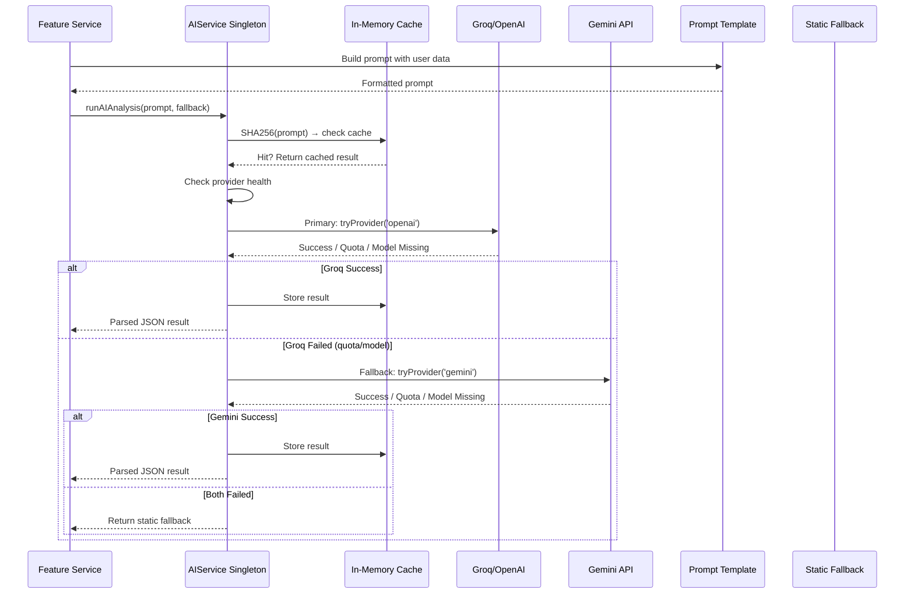

# AI Pipeline

## Architecture



## Provider Chain

### Primary: OpenAI-compatible (Groq)
- **Endpoint**: `https://api.groq.com/openai/v1/chat/completions`
- **Models** (tried in order): llama-3.3-70b-versatile → llama-3.1-8b-instant
- **Config**: max_tokens=8000, system: "Return valid JSON only"
- **Non-reasoning models**: temperature=0.2
- **Reasoning models** (grok-*-mini, o1, o3): temperature omitted
- **Auth**: `Bearer $OPENAI_API_KEY`
- **Timeout**: 30s

### Fallback: Google Gemini
- **Models** (tried in order): gemini-2.0-flash → gemini-2.0-flash-lite → gemini-2.5-flash
- **Config**: Using `@google/generative-ai` SDK
- **Auth**: `GEMINI_API_KEY` or `GEMINI_FALLBACK_API_KEY`

## Cooldown Logic

On quota exhaustion (429 / RESOURCE_EXHAUSTED):
- **Groq cooldown**: 30 minutes (configurable via `OPENAI_COOLDOWN_MS`)
- **Gemini cooldown**: 3 minutes (configurable via `GEMINI_COOLDOWN_MS`)
- During cooldown, that provider is skipped
- Leads to faster fallback or static response

## In-Memory Prompt Cache

```javascript
cache = new Map()  // SHA256(prompt) → parsed JSON result
```

- No expiration (lives for process lifetime)
- Keyed on full prompt content
- Bypasses both AI providers entirely on cache hit
- No Redis involved for this cache

## Prompt System

Prompts are kept in `backend/src/prompts/` as template functions:

| Prompt File | Used By | Purpose |
|------------|---------|---------|
| `githubPrompt.js` | `githubservice.js` | GitHub profile AI insights |
| `resumePrompt.js` | `resumeservice.js` | Resume scoring and feedback |
| `skillGapPrompt.js` | `skillgapcontroller.js` | Skill gap analysis |
| `recommendationPrompt.js` | `recommendationscontroller.js` | Career recommendations |
| `portfolioScorePrompt.js` | `analysisservice.js` | Portfolio scoring |
| `careerSprintPrompt.js` | `careerSprintService.js` | Sprint plan generation |
| No current course prompt | `courseService.js` | Deterministic course pool/ranking; no AI prompt on normal course reads |
| `jobPrompt.js` | `jobService.js` | Job matching |
| `interviewPrepPrompt.js` | `interviewPrepService.js` | Interview Q&A generation |
| `resumeGuidePrompt.js` | `resumeGuideService.js` | Resume improvement guide |
| `weeklyReportPrompt.js` | `weeklyReportService.js` | Weekly report content |

Each prompt template function takes structured data and returns a text prompt instructing the LLM to return specific JSON.

## JSON Extraction & Repair

`aiservice.extractJson()`:
1. Strip markdown code fences
2. Try `JSON.parse()` directly
3. Try regex extraction of outermost `{...}` or `[...]`
4. Auto-repair truncated JSON (close unclosed braces/brackets)
5. Throw if all attempts fail

## Fallback Strategy

Every AI call requires a `fallback` parameter — a static JSON object that is returned when both providers fail. Fallback values are constructed with deterministic logic:

```javascript
const fallback = { developerLevel: 'Beginner', strengths: [...], weakAreas: [...], summary: '...' }
const result = await aiService.runAIAnalysis(prompt, fallback)
```

## Error Handling & Retry

Per-model retry with exponential backoff:
- Attempt 0: immediate
- Attempt 1: 1s delay
- Attempt 2: 4s delay
- Default retries: 2 per model

Error types:
- **404 / model_not_found**: Skip model, try next
- **429 / quota**: Mark provider as exhausted, try fallback provider
- **Network errors**: Retry, then skip model

## Critical File: `services/aiservice.js`

**Why it exists**: Central orchestrator for all LLM calls across every feature.

**Who uses it**: githubservice, resumeservice, skillgapcontroller, recommendationscontroller, careerSprintService, courseService, interviewPrepService, scenarioSimulatorService, resumeGuideService, weeklyReportService

**What depends on it**: All AI-powered features (GitHub analysis, resume analysis, skill gap, recommendations, courses, jobs, interview prep, career sprints, scenario simulator, weekly reports)

**When to modify**: 
- Adding a new AI provider
- Changing provider priority
- Adjusting retry/cooldown behavior
- Changing model candidates

**What must remain backward compatible**: The `runAIAnalysis(prompt, fallback, retries)` method signature. All callers pass (prompt, fallback) and expect a parsed JSON object back.

## Adding a New AI Feature

1. Create prompt template in `src/prompts/newFeaturePrompt.js`
2. Export a function that takes structured input, returns a text prompt
3. In your service, call `aiService.runAIAnalysis(prompt, fallback)`
4. Build a static fallback object that the feature can degrade to
5. No need to modify `aiservice.js` itself

## PlatformSettings Override

Admin can configure AI provider at runtime:
- `platformSettingsService.getAiSnapshotSync()` returns current settings
- Settings include: `provider` (openai/gemini), `apiKey`, `model`, `enabled`
- If `enabled === false`, all AI calls return fallback immediately
- Settings are read from MongoDB `platformSettings` collection
