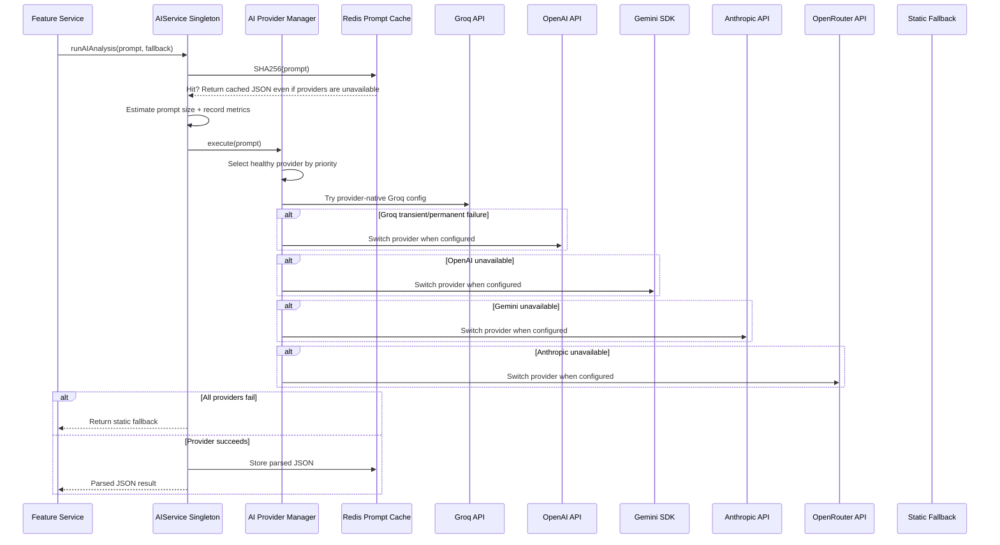

# AI Pipeline

## Architecture



## Provider Configuration

Provider names and model names are separate. Do not put Groq models in `OPENAI_MODEL`.

| Provider | API key env | Model env | SDK/client |
|---|---|---|---|
| Groq | `GROQ_API_KEY` | `GROQ_MODEL` or `GROQ_MODELS` | OpenAI-compatible HTTPS endpoint at `https://api.groq.com/openai/v1/chat/completions` |
| Gemini | `GEMINI_API_KEY` | `GEMINI_MODEL` or `GEMINI_MODELS` | `@google/generative-ai` |
| OpenAI | `OPENAI_API_KEY` | `OPENAI_MODEL` or `OPENAI_MODELS` | OpenAI chat completions endpoint |
| Anthropic | `ANTHROPIC_API_KEY` | `ANTHROPIC_MODEL` or `ANTHROPIC_MODELS` | Anthropic Messages API |
| OpenRouter | `OPENROUTER_API_KEY` | `OPENROUTER_MODEL` or `OPENROUTER_MODELS` | OpenAI-compatible HTTPS endpoint |

Default model candidates:
- Groq: `llama-3.3-70b-versatile`, `llama-3.1-8b-instant`
- OpenAI: `gpt-4.1-mini`, `gpt-4o-mini`
- Gemini: `gemini-2.5-flash`, `gemini-2.0-flash`, `gemini-2.0-flash-lite`
- Anthropic: `claude-3-7-sonnet-latest`
- OpenRouter: no default model; configure `OPENROUTER_MODEL`.

Provider priority is configured with `AI_PROVIDER_PRIORITY`, for example:

```env
AI_PROVIDER_PRIORITY=groq,openai,gemini,anthropic,openrouter
```

Admin Platform Settings can still select `provider`, `model`, and encrypted API key at runtime. Settings are validated against the selected provider. Incompatible models are ignored and logged.

## Provider Routing

`services/aiProviderManager.js` owns provider registration, routing, health, retries, model validation, and failover. Business features call `services/aiservice.js`, and `aiservice.js` only handles the stable public contract, prompt cache, JSON parsing, fallback behavior, and metrics.

The provider manager:
- Selects the SDK/client by provider, not by model string.
- Rejects provider/model mismatches such as Gemini model names on OpenAI, Groq model names on OpenAI, or OpenAI model names on Gemini.
- Logs startup configuration issues immediately.
- Initializes only providers with valid API keys and model configuration.
- Tracks runtime health: requests, success rate, failures, average latency, last success, last failure, and cooldown.
- Logs provider selected, provider switched, provider disabled, retry reason, AI latency, and provider health.

Startup status uses human-readable lines plus structured logs:

```text
[AIProviderManager] ✓ Groq Ready
[AIProviderManager] ✗ Anthropic Disabled (missing_key)
```

## Retry Policy

Permanent errors are not retried:
- `400`
- `401`
- `403`
- `404`
- `413`

Transient errors may be retried:
- timeout
- `429`
- `500`
- `502`
- `503`
- `504`

`429` starts a provider cooldown and fails over to the next configured provider. Unknown permanent-looking provider/model errors fail over instead of burning retry time.

## Shared AI Cache

```javascript
ai:response:<sha256(prompt)> -> parsed JSON result
ai:deterministic:<sha256(feature identity)> -> deterministic summary
```

- Primary scope: Redis when `REDIS_URL` is configured and connected.
- Fallback scope: process memory when Redis is disabled or unavailable.
- Expiration: `AI_RESPONSE_CACHE_TTL_SECONDS` for AI responses, `AI_DETERMINISTIC_CACHE_TTL_SECONDS` for deterministic summaries.
- Purpose: avoid identical AI calls and reuse deterministic computations across feature requests.
- Invalidation: `AIService.invalidateCacheKey()` and `AIService.invalidateCachePrefix()`.
- Logging: `prompt_cache_hit`, `prompt_cache_miss`, `redis_cache_hit`, `redis_cache_miss`, `redis_cache_set`.

## Prompt System

Prompts are kept in `backend/src/prompts/` as template functions.

| Prompt File | Used By | Purpose |
|---|---|---|
| `githubPrompt.js` | `githubservice.js` | GitHub profile AI insights |
| `resumePrompt.js` | `resumeservice.js` | Resume scoring and feedback |
| `skillGapPrompt.js` | `skillgapcontroller.js` | Skill gap analysis |
| `recommendationPrompt.js` | `recommendationscontroller.js` | Career recommendations |
| `portfolioScorePrompt.js` | `analysisservice.js` | Portfolio scoring |
| `careerSprintPrompt.js` | `careerSprintService.js` | Sprint plan generation |
| `jobPrompt.js` | `jobService.js` | Job matching |
| `interviewPrepPrompt.js` | `interviewPrepService.js` | Interview Q&A generation |
| `resumeGuidePrompt.js` | `resumeGuideService.js` | Resume improvement guide |
| `weeklyReportPrompt.js` | `weeklyReportService.js` | Weekly report content |

AI prompt templates use `backend/src/services/promptBuilderService.js` for compact JSON, bounded text, and summarized evidence. Skill Gap, GitHub Analyzer, Resume Analysis, Recommendations, Career Sprint, Interview Prep, Portfolio Score, Weekly Reports, Resume Guide, Jobs, and Courses share the same compaction helpers.

Resume Analysis keeps every factual field deterministic. Its optional AI call can only return a subset of backend-provided focus-area codes; the backend maps accepted codes to fixed improvement text and rejects unknown values. AI output cannot supply employers, skills, certifications, schools, dates, experience, scores, recruiter facts, or resume signals. Any AI/cache/provider exception falls back to the complete deterministic result.

Skill Gap builds a compact context before calling `getSkillGapPrompt()`. It summarizes GitHub repositories, resume evidence, portfolio, sprint, weekly report, integration, and job-demand signals instead of sending raw source objects. Resume Analysis sends a bounded resume evidence summary instead of unbounded raw resume text. Prompt size is estimated before every AI request, with a target below 5000 input tokens.

Reusable prompt compaction helpers live in `backend/src/services/promptBuilderService.js`. Feature code should:
- Check feature-level caches first.
- Skip AI when deterministic confidence is sufficient.
- Build compact prompt context only when AI is required.
- Avoid raw objects, duplicate text, and repeated evidence.

Skill Gap uses `SKILL_GAP_AI_THRESHOLD` to decide whether deterministic confidence is sufficient. The default is `70`. Prompt construction remains behind the result-cache miss and AI execution gate, so cached and deterministic-skip requests do not build prompts.

## JSON Extraction And Repair

`aiservice.extractJson()`:
1. Strips markdown code fences.
2. Attempts direct `JSON.parse()`.
3. Extracts the outermost JSON object or array.
4. Repairs truncated JSON by closing unclosed braces/brackets.
5. Throws if all parsing attempts fail.

## Fallback Strategy

Every AI call requires a deterministic fallback:

```javascript
const result = await aiService.runAIAnalysis(prompt, fallback);
```

If AI is disabled, no provider is configured, providers fail, or JSON parsing fails after routing, the fallback is returned. The public method signature remains `runAIAnalysis(prompt, fallback, retries)`.

## Observability

AI logs are structured JSON strings prefixed with `[AIService]`.

Important events:
- `providers_ready`
- `provider_missing_key`
- `provider_model_mismatch`
- `settings_model_ignored`
- `prompt_size`
- `prompt_cache_hit`
- `prompt_cache_miss`
- `redis_cache_hit`
- `redis_cache_miss`
- `redis_cache_set`
- `provider_selected`
- `provider_switched`
- `retry_scheduled`
- `provider_success`
- `provider_error`
- `ai_request_complete`
- `fallback_all_providers_failed`

Provider-manager logs are structured JSON strings prefixed with `[AIProviderManager]` and include:
- `provider_selected`
- `provider_switched`
- `provider_disabled`
- `provider_success`
- `provider_error`
- `retry_scheduled`

Skill Gap request-stage logs are prefixed with `[SkillGapPipeline]` and include cache hit/miss, GitHub cache status, stale cache served, GitHub refresh queued, prompt generation size, AI skipped, AI executed, stage timings, response size, and total request duration. GitHub SWR refresh logs are prefixed with `[GitHubSWR]` and include refresh started, refresh deduped, refresh completed, refresh failed, refresh duration, and TTL-index migration status. AIService benchmark metrics include total AI request time, AI provider latency, Redis latency, prompt size, estimated tokens, cache hit/miss ratio, deterministic skip ratio, provider used, failover, and retry reasons.

## Benchmark Utility

Run the dry benchmark without making external AI calls:

```powershell
node backend\src\scripts\benchmarkAIInfrastructure.js
```

Run the live benchmark only when API keys are configured and a real provider call is acceptable:

```powershell
node backend\src\scripts\benchmarkAIInfrastructure.js --live
```

The report includes enabled/disabled providers, provider health, per-feature prompt size, average and p95 prompt tokens, AIService shared-cache metrics, deterministic skip ratio, database index additions, and live provider latency when `--live` is used.
