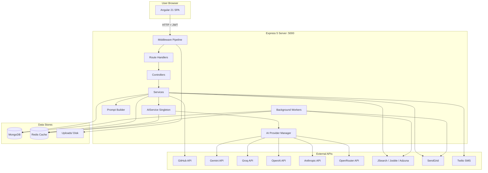
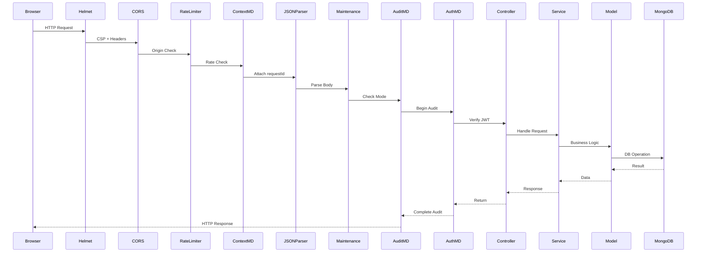

# Architecture

## System Architecture Diagram



## Tier Breakdown

### Presentation Tier (Frontend)
- **Technology**: Angular 21, TypeScript 5.9, SCSS, RxJS
- **Location**: `frontend/src/`
- **Entry**: `frontend/src/main.ts` → `app/app.ts`
- **Port**: 4200 (dev), proxied to backend via `proxy.conf.json`
- **Key Modules**: Standalone components, lazy-loaded Admin/Recruiter/SuperAdmin modules

### Application Tier (Backend)
- **Technology**: Node.js, Express 5, CommonJS modules
- **Location**: `backend/`
- **Entry**: `backend/index.js`
- **Port**: 5000 (configurable via `PORT` env)
- **Architecture Pattern**: Layered (Routes → Controllers → Services → Models)

### Data Tier
- **Primary DB**: MongoDB (via Mongoose 9 ODM)
- **Cache**: Redis 4 (via `redis` npm package)
- **File Storage**: Local disk at `backend/uploads/`

### AI Tier
- **Providers**: Groq, OpenAI, Google Gemini, Anthropic, and OpenRouter are configured separately.
- **Provider Manager**: `backend/src/services/aiProviderManager.js` owns registration, provider priority, provider health, failover, retry policy, cooldown, and provider/model validation.
- **Model Routing**: Provider-specific model env vars (`GROQ_MODEL`, `OPENAI_MODEL`, `GEMINI_MODEL`, `ANTHROPIC_MODEL`, `OPENROUTER_MODEL`) are validated before use.
- **Public Facade**: `backend/src/services/aiservice.js` preserves the shared `runAIAnalysis(prompt, fallback, retries)` contract and owns Redis-backed prompt cache, deterministic summary cache helpers, JSON parsing, fallbacks, and metrics.
- **Prompt Builder**: `backend/src/services/promptBuilderService.js` contains reusable compaction helpers so features can summarize evidence before AI calls and keep prompts below the 5000-token target.

## Request Lifecycle



## Backend Architecture Pattern

```
routes/auth.routes.js  ──→ controllers/authcontroller.js  ──→ services/otpService.js
                                                                 services/emailService.js
                                                                 models/user.js

routes/github.routes.js ──→ controllers/githubcontroller.js ──→ services/githubservice.js
                                                                  services/aiservice.js
                                                                  models/repository.js
                                                                  models/analysis.js
                                                                  models/githubAnalysisCache.js
```

Every domain follows: **Route → Controller → Service → Model** with `aiservice.js` as a cross-cutting dependency.

## Deployment Topology

```
┌─────────────────────────────────────────────────┐
│  Frontend (Angular)                              │
│  Served via nginx / CDN or ng serve (dev)        │
│  Port: 4200 (dev) / 80,443 (prod)                │
└───────────────┬─────────────────────────────────┘
                │ /api/* proxy
┌───────────────▼─────────────────────────────────┐
│  Backend (Express)                               │
│  Port: 5000                                      │
│  ┌──────────────────────────────────────────┐    │
│  │ Middleware Pipeline                       │    │
│  │ helmet → cors → rate-limit → context →   │    │
│  │ JSON → maintenance → uploads → metrics → │    │
│  │ logger → audit → auth (per-route)         │    │
│  └──────────────────────────────────────────┘    │
│  ┌──────────────────────────────────────────┐    │
│  │ Background Workers                        │    │
│  │ Email Retry, Integration Sync,            │    │
│  │ Job Source Sync, Weekly Reports,          │    │
│  │ Interview Ingestion, Interview Maintenance│    │
│  └──────────────────────────────────────────┘    │
└───────┬─────────────────────┬───────────────────┘
        │                     │
┌───────▼───────┐    ┌───────▼───────┐
│   MongoDB     │    │    Redis      │
│   Primary DB  │    │  Cache Layer  │
└───────────────┘    └───────────────┘
```

## Key Architectural Decisions

1. **Singleton AI Facade + Provider Manager**: Features call one `AIService` singleton. Provider-specific logic is isolated in `AIProviderManager`, so business logic does not know which provider is used.

2. **CommonJS over ESM**: The backend uses `require()` throughout. Import statements are not used in backend.

3. **No Dependency Injection in Backend**: Services are plain modules that export singletons or constructor functions. No DI container.

4. **Layered Cache Strategy**: Redis is the shared cache for AI responses, deterministic summaries, dashboard data, and general reusable values. AIService keeps only a process-memory fallback when Redis is unavailable. MongoDB-based caches remain the durable layer for GitHub analysis, resume analysis, job results, and feature analysis payloads.

5. **Compact Prompt Boundary**: AI features must summarize repositories, resumes, reports, sprint state, job demand, and developer signals through `promptBuilderService.js` before calling the provider manager. Raw provider routing and retry logic stays centralized.

6. **Skill Gap Stale-While-Revalidate**: Skill Gap checks its result cache before GitHub reads, signal aggregation, prompt construction, or AI execution. On cache miss it serves cached GitHub analysis immediately, including stale rows, and queues one background refresh per GitHub username. GitHub refresh failures do not fail Skill Gap requests.

7. **RBAC via Middleware**: Role checks happen in `authmiddleware.js` after JWT verification. Super admin gets global bypass.

8. **Lazy-Loaded Frontend Modules**: Admin, Recruiter, and Super Admin modules are lazy-loaded to reduce initial bundle size.

9. **Background Workers Start on Boot**: All cron/scheduled jobs are initialized in `index.js` after server.listen().
