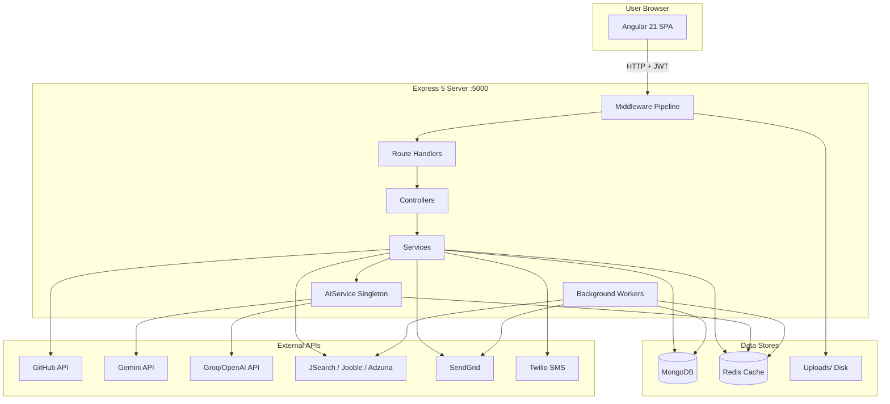
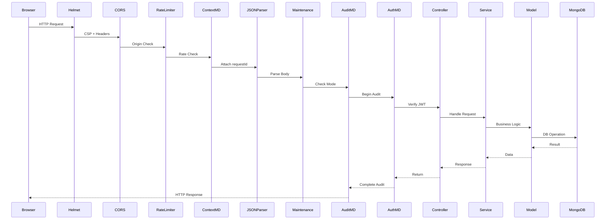

# Architecture

## System Architecture Diagram



## Tier Breakdown

### Presentation Tier (Frontend)
- **Technology**: Angular 21, TypeScript 5.9, SCSS, RxJS
- **Location**: `frontend/src/`
- **Entry**: `frontend/src/main.ts` → `app/app.ts`
- **Port**: 4200 (dev), proxied to backend via `proxy.conf.json`
- **Key Modules**: Standalone components, lazy-loaded Admin/Recruiter/SuperAdmin modules

### Application Tier (Backend)
- **Technology**: Node.js, Express 5, CommonJS modules
- **Location**: `backend/`
- **Entry**: `backend/index.js`
- **Port**: 5000 (configurable via `PORT` env)
- **Architecture Pattern**: Layered (Routes → Controllers → Services → Models)

### Data Tier
- **Primary DB**: MongoDB (via Mongoose 9 ODM)
- **Cache**: Redis 4 (via `redis` npm package)
- **File Storage**: Local disk at `backend/uploads/`

### AI Tier
- **Primary Provider**: Groq-hosted OpenAI-compatible models (llama-3.3-70b, llama-3.1-8b)
- **Fallback Provider**: Google Gemini (gemini-2.0-flash, gemini-2.5-flash)
- **Orchestration**: `backend/src/services/aiservice.js` (singleton)

## Request Lifecycle



## Backend Architecture Pattern

```
routes/auth.routes.js  ──→ controllers/authcontroller.js  ──→ services/otpService.js
                                                                 services/emailService.js
                                                                 models/user.js

routes/github.routes.js ──→ controllers/githubcontroller.js ──→ services/githubservice.js
                                                                  services/aiservice.js
                                                                  models/repository.js
                                                                  models/analysis.js
                                                                  models/githubAnalysisCache.js
```

Every domain follows: **Route → Controller → Service → Model** with `aiservice.js` as a cross-cutting dependency.

## Deployment Topology

```
┌─────────────────────────────────────────────────┐
│  Frontend (Angular)                              │
│  Served via nginx / CDN or ng serve (dev)        │
│  Port: 4200 (dev) / 80,443 (prod)                │
└───────────────┬─────────────────────────────────┘
                │ /api/* proxy
┌───────────────▼─────────────────────────────────┐
│  Backend (Express)                               │
│  Port: 5000                                      │
│  ┌──────────────────────────────────────────┐    │
│  │ Middleware Pipeline                       │    │
│  │ helmet → cors → rate-limit → context →   │    │
│  │ JSON → maintenance → uploads → metrics → │    │
│  │ logger → audit → auth (per-route)         │    │
│  └──────────────────────────────────────────┘    │
│  ┌──────────────────────────────────────────┐    │
│  │ Background Workers                        │    │
│  │ Email Retry, Integration Sync,            │    │
│  │ Job Source Sync, Weekly Reports,          │    │
│  │ Interview Ingestion, Interview Maintenance│    │
│  └──────────────────────────────────────────┘    │
└───────┬─────────────────────┬───────────────────┘
        │                     │
┌───────▼───────┐    ┌───────▼───────┐
│   MongoDB     │    │    Redis      │
│   Primary DB  │    │  Cache Layer  │
└───────────────┘    └───────────────┘
```

## Key Architectural Decisions

1. **Singleton AI Service**: One `AIService` instance handles all LLM calls with provider chaining, cooldown, and retry logic. All features share this single instance.

2. **CommonJS over ESM**: The backend uses `require()` throughout. Import statements are not used in backend.

3. **No Dependency Injection in Backend**: Services are plain modules that export singletons or constructor functions. No DI container.

4. **Dual Cache Strategy**: In-memory Map (AIService prompt cache) + Redis (general caching) + MongoDB-based caches (GitHub analysis, job results).

5. **RBAC via Middleware**: Role checks happen in `authmiddleware.js` after JWT verification. Super admin gets global bypass.

6. **Lazy-Loaded Frontend Modules**: Admin, Recruiter, and Super Admin modules are lazy-loaded to reduce initial bundle size.

7. **Background Workers Start on Boot**: All cron/scheduled jobs are initialized in `index.js` after server.listen().