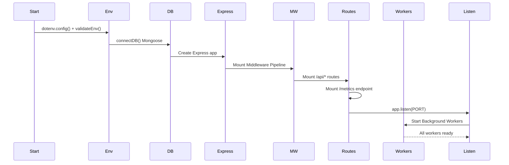
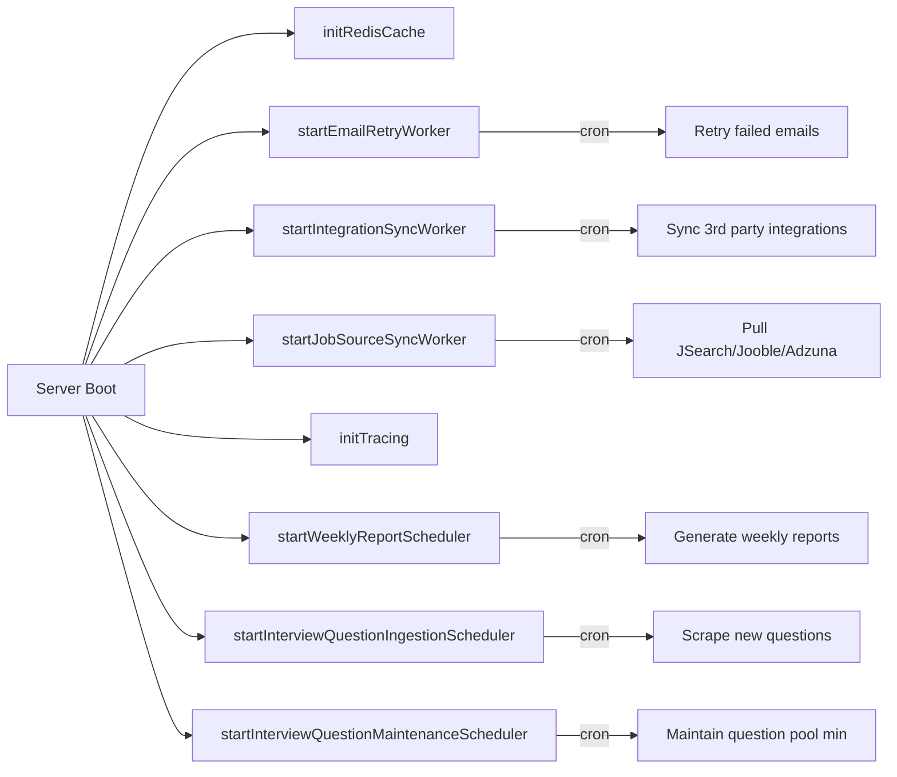
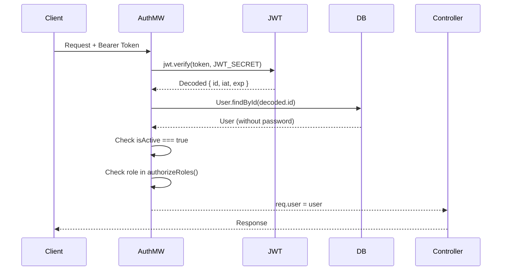

# Backend Flow

## Server Startup Sequence



## Middleware Pipeline (Execution Order)

Every request passes through this ordered chain:

| Order | Middleware | File | Purpose |
|-------|-----------|------|---------|
| 1 | `helmet` | - | Security headers (CSP, X-Frame, etc.) |
| 2 | `cors` | - | Cross-origin resource sharing |
| 3 | `globalRateLimiter` | `middleware/securityMiddleware.js` | Global rate limiting |
| 4 | `requestContextMiddleware` | `middleware/requestContextMiddleware.js` | Attaches `requestId`, logs context |
| 5 | `express.json()` | - | Parse JSON request bodies |
| 6 | `express.urlencoded()` | - | Parse URL-encoded bodies |
| 7 | Maintenance check | `index.js` inline | Blocks requests during maintenance |
| 8 | `/uploads` static | `index.js` inline | Serves uploaded files with cache headers |
| 9 | `metricsMiddleware` | `services/metricsService.js` | Collects Prometheus metrics |
| 10 | Request logger | `index.js` inline (conditional) | Logs requests if `LOG_REQUESTS=true` |
| 11 | `auditLogMiddleware` | `middleware/auditLogMiddleware.js` | Audits write operations |
| 12 | `protect` | `middleware/authmiddleware.js` | JWT verification (per-route) |
| 13 | `authorizeRoles` | `middleware/authmiddleware.js` | Role check (per-route) |
| 14 | `orgMiddleware` | `middleware/orgMiddleware.js` | Org-scoped data access (per-route) |

## Route → Controller → Service Flow

```
router.js                          controller.js                     service.js
─────────                          ─────────────                     ──────────
router.post('/analyze-save',       exports.analyzeAndSaveGitHub =    exports.analyzeGitHubProfile =
  protect,                           async (req, res) => {             async (username) => {
  githubController.analyzeAndSave)     const data = await               // Fetch GitHub data
                                       githubService.analyzeGitHub()    // Build deterministic scores
                                       await Repository.deleteMany()    // Call AI for insights
                                       await analysis.save()            // Return full result
                                       res.json(data)                 }
                                     }
```

### File Responsibility Chain

**Routes** (`src/routes/*.js`):
- Define HTTP method + path + middleware + controller function
- No business logic, only routing
- Why: Isolate URL structure from implementation

**Controllers** (`src/controllers/*.js`):
- Extract request data (`req.body`, `req.params`, `req.user`)
- Call services
- Handle HTTP responses and status codes
- Why: Handle HTTP concerns (status codes, response format)

**Services** (`src/services/*.js`):
- All business logic
- External API calls
- Database operations via models
- Why: Reusable logic, testable independently

**Models** (`src/models/*.js`):
- Mongoose schema definitions
- Why: Data structure, validation, indexes

## Background Workers

All workers start after `app.listen()` in `index.js`:



| Worker | File | Schedule | Purpose |
|--------|------|----------|---------|
| Email Retry | `services/emailRetryQueueService.js` | Periodic | Retries failed email deliveries |
| Integration Sync | `services/integrationSyncService.js` | Periodic | Syncs third-party integrations |
| Job Source Sync | `services/jobSourceSyncService.js` | Periodic | Fetches fresh job listings from JSearch, Jooble, Adzuna |
| Weekly Reports | `services/weeklyReportService.js` | Weekly | Generates and emails developer progress reports |
| Interview Ingestion | `services/interviewQuestionIngestionService.js` | On-demand | Scrapes new interview questions |
| Interview Maintenance | `services/interviewQuestionMaintenanceService.js` | Periodic | Ensures minimum pool size per topic |

## Auth & RBAC Flow



### Role Hierarchy

| Role | Access Level | Definition |
|------|-------------|------------|
| `super_admin` | Global bypass | All routes, all orgs |
| `admin` | Org-scoped | Admin routes + developer routes |
| `recruiter` | Feature-scoped | Recruiter hub + limited developer access |
| `developer` | Self-service | Own profile, analyses, recommendations |

Role normalization: `user`, `guest` → `developer`; `super-admin`, `superadmin` → `super_admin`

### Guard Chain for Protected Routes

```
protect → normalizeUserRole → orgMiddleware → authorizeRoles(...)
```

## Critical Files That Must Not Be Broken

| File | Why |
|------|-----|
| `backend/index.js` | Startup sequence, middleware order, route mounting |
| `middleware/authmiddleware.js` | All authentication and authorization |
| `services/aiservice.js` | All AI calls depend on this singleton |
| `config/db.js` | Database connection for entire application |
| `services/platformSettingsService.js` | Dynamic settings used everywhere |
| `models/user.js` | Used by every controller that touches users |

## Error Handling Pattern

Controllers use try-catch; return structured error responses:

```javascript
res.status(400).json({ message: 'Validation error description' })
res.status(429).json({ message: 'Rate limit message' })
res.status(500).json({ message: error.message || 'Generic error' })
```

Services throw descriptive errors that controllers catch and translate to HTTP response codes.