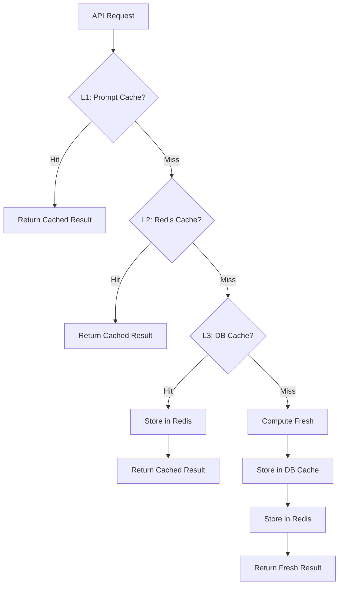

# Cache System

## Cache Layers

## Layer 1: In-Memory Prompt Cache

**Location**: `services/aiservice.js` — `this.cache = new Map()`

| Property | Value |
|----------|-------|
| Key | SHA256 hash of full prompt string |
| Value | Parsed JSON result |
| Scope | Process memory (lost on restart) |
| Expiration | None (permanent for process lifetime) |
| Purpose | Avoid identical AI calls |

**Who manages it**: `aiservice.runAIAnalysis()` checks cache before calling AI providers

## Layer 2: Redis Cache

**Location**: `services/redisCacheService.js`

| Property | Value |
|----------|-------|
| Connection | Redis 4 client |
| Init | `initRedisCache()` called on server boot |

**Used for**:
- Dashboard summary caching
- General key-value caching with TTL
- Cross-request data sharing

## Layer 3: MongoDB-Based Caches

### GitHub Analysis Cache
**Model**: `models/githubAnalysisCache.js`

| Field | Purpose |
|-------|---------|
| `normalizedUsername` | Cache key (lowercase, trimmed) |
| `analysisVersion` | Version-based invalidation |
| `result` | Full analysis payload |
| `snapshots` | Up to 12 historical snapshots |
| `expiresAt` | TTL (24 hours) |

**Flow**:
1. `githubservice.js` checks `GitHubAnalysisCache` before fetching from GitHub
2. If cache hit and not expired: return with `source: 'cache'`
3. If cache miss/expired: fetch fresh, upsert cache, return

**TTL**: 24 hours (configurable via `CACHE_TTL_MS` in githubservice.js)
**Force refresh**: `?forceRefresh=true` bypasses cache

### Job Cache
**Model**: `models/jobCache.js`

Cached job listing results from JSearch, Jooble, Adzuna.
- `jobSourceSyncService.js` periodically refreshes
- Cache health monitored with thresholds (warns if < 100 jobs)

### Analysis Cache
**Model**: `models/analysisCache.js`

General-purpose analysis result cache for non-GitHub analyses.

### Resume Analysis Cache
**Model**: `models/resumeAnalysisCache.js`

Cached resume analysis results to avoid re-processing the same PDF.

## Frontend Cache And Inflight Dedupe

Several Angular services intentionally return cached observables or cached values before making HTTP calls.

| Service | Cache/Dedupe Role |
|---|---|
| `frontend/src/app/shared/services/profile.service.ts` | Memory/localStorage profile cache, `shareReplay` inflight request dedupe, manual refresh bypass. |
| `frontend/src/app/shared/services/frontend-analysis-cache.service.ts` | LocalStorage cache for Dashboard, Skill Gap, Recommendations, News, and Weekly Reports. |
| `frontend/src/app/shared/services/github.service.ts` | In-memory GitHub analysis cache and inflight map. |
| `frontend/src/app/shared/services/skill-gap.service.ts` | Inflight request map and signal-hash result cache helpers. |
| `frontend/src/app/shared/services/recommendations.service.ts` | Inflight request map for recommendation POSTs. |
| `frontend/src/app/shared/services/news.service.ts` | Request dedupe for feed/saved news requests. |
| `frontend/src/app/shared/services/weekly-report.service.ts` | Dashboard read cache and inflight dedupe for latest/history reads. |
| `frontend/src/app/shared/services/course.service.ts` | `shareReplay` cache for course list requests by normalized filters/page/limit. |
| `frontend/src/app/shared/services/career-sprint.service.ts` | In-memory current/history cache and inflight request dedupe. |

Manual refresh paths should bypass the frontend cache exactly once and then repopulate it.

## Profile And Signal Hashes

| Signal | Owner | Purpose |
|---|---|---|
| `profileHash` | `backend/src/controllers/profilecontroller.js`, mirrored by `ProfileService`/`CareerProfileService` | Changes when personalization fields change: active GitHub username, active stack, active level, career goal, timeline, learning preference. |
| `signalHash` | Feature services/controllers that aggregate developer signals | Prevents stale personalized caches after GitHub/resume/skill/recommendation/sprint/report changes. |

Profile changes may clear frontend caches for Dashboard, Skill Gap, Recommendations, News, Weekly Reports, and Scenario context. They must not delete persisted GitHub analysis, resume analysis, saved reports, saved scenarios, or Career Sprint history.

## Cache Invalidation Strategy

| Cache | Invalidation Trigger |
|-------|---------------------|
| In-Memory Prompt Cache | Process restart only |
| Redis | TTL-based + explicit invalidation on write |
| GitHub Analysis Cache | `forceRefresh=true`, 24h TTL, new analysis version |
| Job Cache | Periodic worker refresh |
| Dashboard Summary | Invalidated after GitHub/resume save |
| Profile-dependent frontend modules | Invalidated when `profileHash`/profile signature changes |
| Scenario Context | Invalidated after signal mutations or mounted profile signature changes |

## Important: Dashboard Summary Invalidation

When a user saves a new GitHub or resume analysis, `dashboardcontroller.invalidateDashboardSummaryCache(userId)` is called to clear cached dashboard data for that user.

## Cache Health Monitoring

`jobService.getCacheHealth()` returns:
- `cacheStatus`: 'HEALTHY', 'MODERATE', or 'LOW'
- `totalCachedJobs`: current job count
- Warning logged on startup if < 100 threshold

## Files to Know

| File | Role |
|------|------|
| `services/aiservice.js` | In-memory prompt cache |
| `services/redisCacheService.js` | Redis connection and general caching |
| `models/githubAnalysisCache.js` | GitHub analysis persistence cache |
| `models/jobCache.js` | Job listing cache |
| `models/analysisCache.js` | General analysis cache |
| `models/resumeAnalysisCache.js` | Resume analysis cache |
| `services/jobService.js` | Job cache health checks |
| `services/jobSourceSyncService.js` | Periodic job cache refresh |
