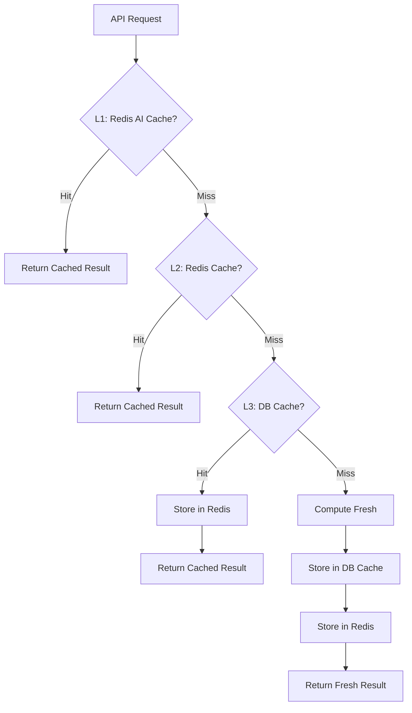

# Cache System

## Cache Layers

## Layer 1: Shared AI Cache

**Location**: `services/aiservice.js` plus `services/redisCacheService.js`

| Property | Value |
|----------|-------|
| Key | `ai:response:<sha256(prompt)>` or `ai:deterministic:<sha256(feature identity)>` |
| Value | Parsed AI JSON result or deterministic summary |
| Scope | Redis when configured; process-memory fallback when Redis is unavailable |
| Expiration | `AI_RESPONSE_CACHE_TTL_SECONDS` and `AI_DETERMINISTIC_CACHE_TTL_SECONDS` |
| Purpose | Avoid identical AI calls and reuse deterministic computations |

**Who manages it**: `aiservice.runAIAnalysis()` checks the shared cache before calling AI providers. `AIService.getDeterministicSummary()` and `AIService.setDeterministicSummary()` manage deterministic summaries separately from AI responses.

Prompt cache hits are logged as `prompt_cache_hit`; misses are logged as `prompt_cache_miss`. Redis timings are logged as `redis_cache_hit`, `redis_cache_miss`, and `redis_cache_set`. Prompt cache keys are still based on the final prompt string, but feature code should avoid building prompts until after DB/cache checks and deterministic skip gates.

`services/aiservice.js` also keeps process-local benchmark counters:
- request count
- AI calls
- fallbacks
- deterministic skips
- prompt-cache hit ratio and Redis hit/miss counters
- average prompt size
- average request latency
- average AI latency
- average Redis latency

Run `node backend\src\scripts\benchmarkAIInfrastructure.js` for a dry benchmark summary. Add `--live` only when real provider calls are acceptable.

### Skill Gap Deterministic Summary Cache

**Location**: `backend/src/controllers/skillgapcontroller.js`

| Property | Value |
|---|---|
| Key | SHA256 of username, career stack, experience level, resume hash, resume analysis id, signal hash, and analysis version |
| Value | Deterministic skill groups used before AI merge |
| Scope | Redis shared cache, with process-memory fallback |
| TTL | `AI_DETERMINISTIC_CACHE_TTL_SECONDS` (default 10 minutes) |
| Purpose | Reuse deterministic summaries separately from AI output for identical personalized signal states |

This cache does not replace `AnalysisCache`. It only avoids repeated deterministic transformations on fresh requests that share the same resume/profile/signal identity. The cache key is managed through `AIService.getDeterministicSummary('skill_gap', identity)` and `AIService.setDeterministicSummary('skill_gap', identity, value)`.

Skill Gap records deterministic AI skips through `AIService.recordDeterministicSkip('skill_gap')`, which lets the AI benchmark report how often production requests avoid provider calls.

### Skill Gap Result Cache

**Location**: `backend/src/controllers/skillgapcontroller.js` using `AIService.getSharedCache()`

| Property | Value |
|---|---|
| Key | `skill_gap:result:<sha256(username, stack, level, resume identity, stable profile/cache signal, analysisVersion)>` |
| Value | Full Skill Gap response payload plus cache timestamp |
| Scope | Redis shared cache, with process-memory fallback |
| TTL | 15 minutes |
| Purpose | Return repeated same-identity requests before Mongo cache lookup, GitHub analysis, prompt building, or AI execution |

`forceRefresh=true` bypasses this cache for the current request.

Skill Gap checks this result cache before GitHub cache reads, developer signal aggregation, skill detection, prompt construction, or AI calls. The stable cache signal intentionally excludes prior Skill Gap output so saving a Skill Gap result does not invalidate the next identical request.

## Layer 2: Redis Cache

**Location**: `services/redisCacheService.js`

| Property | Value |
|----------|-------|
| Connection | Redis 4 client |
| Init | `initRedisCache()` called on server boot |

**Used for**:
- Dashboard summary caching
- General key-value caching with TTL
- Cross-request data sharing

## Layer 3: MongoDB-Based Caches

### GitHub Analysis Cache
**Model**: `models/githubAnalysisCache.js`

| Field | Purpose |
|-------|---------|
| `normalizedUsername` | Cache key (lowercase, trimmed) |
| `analysisVersion` | Version-based invalidation |
| `result` | Full analysis payload |
| `snapshots` | Up to 12 historical snapshots |
| `expiresAt` | Application freshness deadline (24 hours) |

**Flow**:
1. `githubservice.js` checks `GitHubAnalysisCache` before fetching from GitHub.
2. GitHub Analyzer can still request fresh analysis when needed.
3. Skill Gap uses Stale-While-Revalidate: fresh rows return with `source: 'cache'`; expired rows return with `source: 'stale-cache'` and queue a background refresh.
4. If Skill Gap has no GitHub cache row, it returns a safe empty GitHub signal and queues a background refresh instead of blocking the request.
5. Background refreshes are locked by normalized GitHub username. Redis provides a cross-process lock when enabled; otherwise the backend falls back to an in-process lock.
6. After a successful background refresh, stored Skill Gap `AnalysisCache` rows for that GitHub username and `v6-skill-intelligence` are deleted, and shared `skill_gap:result` entries are invalidated.

**Freshness TTL**: 24 hours (configurable via `CACHE_TTL_MS` in githubservice.js)
**Force refresh**: `?forceRefresh=true` bypasses cache

The cache keeps stale rows for SWR. The service checks for older Mongo TTL indexes on `expiresAt` and replaces them with a normal index so stale rows are not deleted by MongoDB before they can be served.

### Job Cache
**Model**: `models/jobCache.js`

Cached job listing results from JSearch, Jooble, Adzuna.
- `jobSourceSyncService.js` periodically refreshes
- Cache health monitored with thresholds (warns if < 100 jobs)

### Analysis Cache
**Model**: `models/analysisCache.js`

General-purpose analysis result cache for non-GitHub analyses.

Skill Gap uses `AnalysisCache` with `githubUsername`, `careerStack`, `experienceLevel`, `resumeHash`, `resumeAnalysisId`, `signalHash`, and `analysisVersion`. A normal request checks this cache before GitHub SWR reads, developer signal aggregation, skill detection, or AI prompt building. `forceRefresh=true` bypasses the cached result once, queues GitHub refresh in the background, and repopulates Skill Gap cache from currently available evidence.

Prompt generation happens after this cache lookup and after deterministic confidence is evaluated. If the backend cache hits or deterministic confidence is sufficient, Skill Gap does not build an AI prompt and does not call a provider.

### Resume Analysis Cache
**Model**: `models/resumeAnalysisCache.js`

Cached resume analysis results to avoid re-processing the same PDF.

## Frontend Cache And Inflight Dedupe

Several Angular services intentionally return cached observables or cached values before making HTTP calls.

| Service | Cache/Dedupe Role |
|---|---|
| `frontend/src/app/shared/services/profile.service.ts` | Memory/localStorage profile cache, `shareReplay` inflight request dedupe, manual refresh bypass. |
| `frontend/src/app/shared/services/frontend-analysis-cache.service.ts` | LocalStorage cache for Dashboard, Skill Gap, Recommendations, News, and Weekly Reports. |
| `frontend/src/app/shared/services/github.service.ts` | In-memory GitHub analysis cache and inflight map. |
| `frontend/src/app/shared/services/skill-gap.service.ts` | Inflight request map and signal-hash result cache helpers. |
| `frontend/src/app/shared/services/recommendations.service.ts` | Inflight request map for recommendation POSTs. |
| `frontend/src/app/shared/services/news.service.ts` | Request dedupe for feed/saved news requests. |
| `frontend/src/app/shared/services/weekly-report.service.ts` | Dashboard read cache and inflight dedupe for latest/history reads. |
| `frontend/src/app/shared/services/course.service.ts` | `shareReplay` cache for course list requests by normalized filters/page/limit. |
| `frontend/src/app/shared/services/career-sprint.service.ts` | In-memory current/history cache and inflight request dedupe. |

Manual refresh paths should bypass the frontend cache exactly once and then repopulate it.

## Profile And Signal Hashes

| Signal | Owner | Purpose |
|---|---|---|
| `profileHash` | `backend/src/controllers/profilecontroller.js`, mirrored by `ProfileService`/`CareerProfileService` | Changes when personalization fields change: active GitHub username, active stack, active level, career goal, timeline, learning preference. |
| `signalHash` | Feature services/controllers that aggregate developer signals | Prevents stale personalized caches after GitHub/resume/skill/recommendation/sprint/report changes. |

Profile changes may clear frontend caches for Dashboard, Skill Gap, Recommendations, News, Weekly Reports, and Scenario context. They must not delete persisted GitHub analysis, resume analysis, saved reports, saved scenarios, or Career Sprint history.

## Cache Invalidation Strategy

| Cache | Invalidation Trigger |
|-------|---------------------|
| AI Response Cache | TTL, process restart for memory fallback, or `AIService.invalidateCacheKey()`/`invalidateCachePrefix()` |
| AI Deterministic Summary Cache | TTL, profile/signal identity changes, or `AIService.invalidateCacheKey()`/`invalidateCachePrefix()` |
| Redis | TTL-based + explicit invalidation on write |
| GitHub Analysis Cache | `forceRefresh=true`, 24h TTL, new analysis version |
| Job Cache | Periodic worker refresh |
| Dashboard Summary | Invalidated after GitHub/resume save |
| Profile-dependent frontend modules | Invalidated when `profileHash`/profile signature changes |
| Scenario Context | Invalidated after signal mutations or mounted profile signature changes |

## Important: Dashboard Summary Invalidation

When a user saves a new GitHub or resume analysis, `dashboardcontroller.invalidateDashboardSummaryCache(userId)` is called to clear cached dashboard data for that user.

## Cache Health Monitoring

`jobService.getCacheHealth()` returns:
- `cacheStatus`: 'HEALTHY', 'MODERATE', or 'LOW'
- `totalCachedJobs`: current job count
- Warning logged on startup if < 100 threshold

## Files to Know

| File | Role |
|------|------|
| `services/aiservice.js` | In-memory prompt cache, JSON parsing, AI fallback, and AI benchmark counters |
| `services/aiProviderManager.js` | Provider health, priority, retry, failover, and model validation |
| `services/promptBuilderService.js` | Reusable compact prompt summaries |
| `services/redisCacheService.js` | Redis connection and general caching |
| `models/githubAnalysisCache.js` | GitHub analysis persistence cache |
| `models/jobCache.js` | Job listing cache |
| `models/analysisCache.js` | General analysis cache |
| `models/resumeAnalysisCache.js` | Resume analysis cache |
| `services/jobService.js` | Job cache health checks |
| `services/jobSourceSyncService.js` | Periodic job cache refresh |
