# Database

## Technology
- **Database**: MongoDB
- **ODM**: Mongoose 9
- **Connection**: `backend/src/config/db.js`

## Collections Map

```mermaid
erDiagram
    User ||--o{ Analysis : "userId"
    User ||--o{ ResumeAnalysis : "userId"
    User ||--o{ Repository : "ownerId"
    User ||--o{ Recommendation : "userId"
    User ||--o{ SkillGraph : "userId"
    User ||--o{ CareerSprint : "userId"
    User ||--o{ WeeklyReport : "userId"
    User ||--o{ ScenarioSimulation : "userId"
    User ||--o{ InterviewPrepSession : "userId"
    User ||--o{ Notification : "userId"
    User ||--o{ AuditLog : "userId"
    User ||--o{ WorkflowRun : "userId"
    User ||--o{ PublicProfile : "userId"
    User ||--o{ IntegrationConnection : "userId"
    User ||--o| Organization : "organizationId"
    User ||--o| ResumeFile : "defaultResumeFileId"

    Organization ||--o{ User : "organizationId"
    Organization ||--o{ Team : "organizationId"
    Organization ||--o{ Membership : "organizationId"
    Organization ||--o{ Invitation : "organizationId"

    Recruiter ||--o{ RecruiterMatch : "recruiterId"
    Recruiter ||--o{ RecruiterShortlist : "recruiterId"
```

## Core Models

### User (`models/user.js`)
**Purpose**: Central identity for all platform users.

Key fields:
- `organizationId` (ObjectId, ref Organization) — org membership
- `email` (String, unique, required)
- `password` (String, hashed with bcryptjs)
- `role` (enum: super_admin, admin, recruiter, developer)
- `githubUsername`, `activeGithubUsername`
- `defaultResumeFileId`, `activeResumeFileId`
- `score` (Number) — current portfolio score
- `careerStack`, `activeCareerStack` (enum: Frontend, Backend, Full Stack, AI/ML)
- `experienceLevel`, `activeExperienceLevel`
- `careerGoal`, `targetTimeline`, `learningPreference`
- `isPublic`, `isVerified`, `isActive`
- `notifications` (embedded subdocument with preferences)
- `recruiterPreferences`, `recruiterDetails`

Indexes: `organizationId`, `isActive`, `isPublic`, `onboardingCompleted`

Who uses it: Every controller that touches users (auth, profile, public-profile, admin, super-admin, recruiter)
What depends on it: Auth middleware, RBAC, org scoping, dashboard aggregation
Backward compatibility: Do NOT remove existing fields; rename is NOT supported

### Organization (`models/organization.js`)
- Tenant/company container
- Links users, teams, memberships

### Analysis (`models/analysis.js`)
**Purpose**: Aggregated analysis results per user.

- `userId` — owner
- `githubScore` — GitHub health score
- `githubStats` — repos, stars, forks, followers
- `languageDistribution` — Map of language → percentage
- `contributionActivity` — monthly commit data
- `resumeScore` — resume analysis score
- `githubAnalysisHistory` — up to 12 historical snapshots
- `analysisVersion` — version tracking

Who uses it: dashboardcontroller, githubcontroller, resumecontroller, weeklyReportService

### AnalysisCache (`models/analysisCache.js`)
Generic analysis cache for non-GitHub analysis results.

### ResumeAnalysis (`models/resumeAnalysis.js`)
Per-user resume analysis results with AI feedback.

### ResumeFile (`models/resumeFile.js`)
Uploaded resume file metadata. Stored on disk in `uploads/`.

### Repository (`models/repository.js`)
GitHub repository metadata linked to user.

### Skill / SkillGraph (`models/skill.js`, `models/skillGraph.js`)
User's detected skills and skill relationship graph.

### Recommendation (`models/recommendation.js`)
AI-generated recommendations for learning and career growth.

### CareerSprint (`models/careerSprint.js`)
Structured career acceleration plans with milestones.

### WeeklyReport (`models/weeklyReport.js`)
Auto-generated weekly progress reports.

### Job / JobCache / JobSourceHealth (`models/Job.js`, `models/jobCache.js`, `models/jobSourceHealth.js`)
Job listings from external APIs (JSearch, Jooble, Adzuna) with source health tracking.

### InterviewQuestionBank (`models/interviewQuestionBank.js`)
Self-growing question pool with topic buckets.
- `topicKey`, `topicType`, `topicDimensions`
- `sourceType` (ai_generated, scraped, user_asked, seed)
- `confidence` score
- Deduplication fields

### InterviewPrepSession (`models/interviewPrepSession.js`)
User interview practice sessions.

### ScenarioSimulation (`models/scenarioSimulation.js`)
Career scenario "what-if" modeling results.

### Recruiter / RecruiterMatch / RecruiterShortlist (`models/Recruiter.js`, `models/RecruiterMatch.js`, `models/RecruiterShortlist.js`)
Recruiter-side candidate discovery pipeline.

### IntegrationConnection / IntegrationInsight / IntegrationSyncLog (`models/integrationConnection.js`, `models/integrationInsight.js`, `models/integrationSyncLog.js`)
Third-party integration state and sync tracking.

### PlatformSettings (`models/platformSettings.js`)
Global platform configuration (maintenance mode, AI provider settings, integration secrets).

### PublicProfile / PublicProfileView (`models/publicProfile.js`, `models/publicProfileView.js`)
Shareable developer portfolios with view tracking.

### Notification (`models/notification.js`)
User notifications with deduplication support.

### AuditLog (`models/auditLog.js`)
Persistent audit trail for sensitive operations.

### WorkflowRun (`models/workflowRun.js`)
Workflow execution records.

### AiVersion (`models/aiVersion.js`)
AI model version tracking for analysis reproducibility.

### Stats (`models/stats.js`)
Platform-wide usage statistics.

### Membership / Team (`models/membership.js`, `models/team.js`)
Org-level membership and team structures.

### Invitation (`models/invitation.js`)
Team/organization invitations.

### Otp / PendingRegistration (`models/otp.js`, `models/pendingRegistration.js`)
Temporary records for OTP-based registration flow.

### EmailDeliveryJob (`models/emailDeliveryJob.js`)
Queue for email delivery with retry tracking.

### GithubAnalysisCache (`models/githubAnalysisCache.js`)
Cached GitHub analysis results with versioning and snapshot history.

## Data Migration Scripts

| Script | Purpose |
|--------|---------|
| `scripts/seedInterviewQuestionBank.js` | Seeds 20+ prebuilt questions per topic |
| `scripts/migrateInterviewQuestionBankTopicFields.js` | Backfills topic fields on existing questions |
| `scripts/migrateInterviewQuestionBankStructuredAnswers.js` | Migrates answer format |
| `scripts/backfillJobCacheFromAnalysisCache.js` | Backfills job cache from analysis data |
| `scripts/cleanupInvalidMemberships.js` | Cleans stale membership records |

## Important: Modifying Models

When modifying a Mongoose model:
1. Check `DATABASE.md` for who depends on it
2. Never remove fields — use `default` for new fields
3. Run migration scripts for existing documents
4. Update indexes if query patterns change
5. Test with existing data