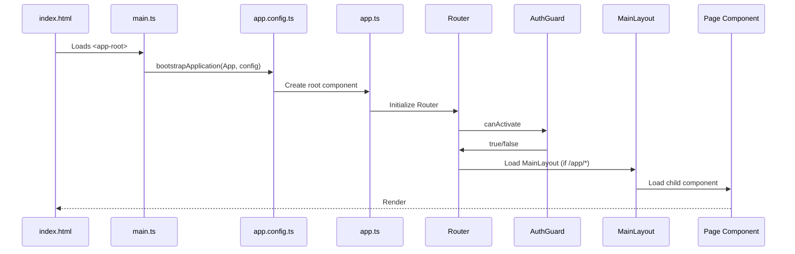
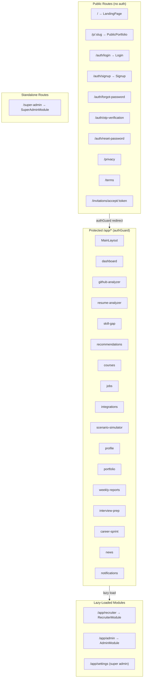
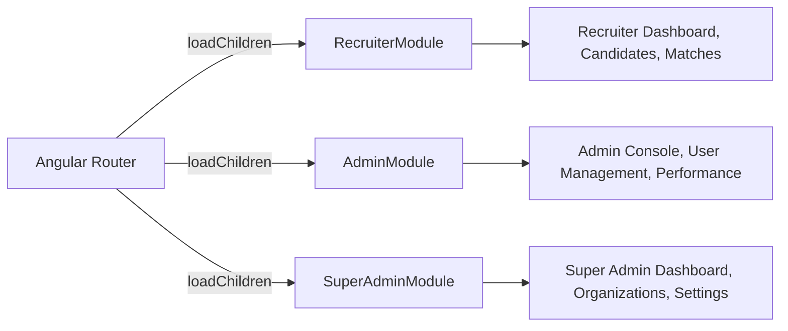

# Frontend Flow

## Angular Bootstrap Sequence



## Route Architecture



## Guards Reference

| Guard | File | Purpose |
|-------|------|---------|
| `authGuard` | `guards/auth.guard.ts` | Redirects to `/auth/login` if no token |
| `publicGuard` | `guards/public.guard.ts` | Redirects to `/app/dashboard` if already authenticated |
| `adminSettingsGuard` | `guards/admin-settings.guard.ts` | Allows `admin` or `super_admin` roles |
| `recruiterRoleGuard` | `guards/recruiter-role.guard.ts` | Allows `recruiter` or `super_admin` roles |
| `noAdminTabsGuard` | `guards/no-admin-tabs.guard.ts` | Blocks admins from developer-only pages |
| `superAdminGuard` | `guards/super-admin.guard.ts` | Allows only `super_admin` |

## Lazy-Loaded Modules



Each lazy module has its own:
- `*.module.ts` — Angular module definition
- Route configuration
- Component tree
- Service dependencies (shared via root injector)

## Component Tree (Simplified)

```
AppComponent
├── LandingPageComponent (public, no layout)
├── Login / Signup (public, no layout)
├── MainLayout (protected wrapper)
│   ├── Sidebar / Navigation
│   ├── Header
│   └── <router-outlet>
│       ├── DashboardComponent
│       ├── GithubAnalyzerComponent
│       ├── ResumeAnalyzerComponent
│       ├── SkillGapComponent
│       ├── RecommendationsComponent
│       ├── ProfileComponent
│       ├── CoursesComponent
│       ├── JobsComponent
│       ├── JobDetailsComponent
│       ├── IntegrationsMarketplaceComponent
│       ├── ScenarioSimulatorComponent
│       ├── PortfolioSettingsComponent
│       ├── WeeklyReportsComponent
│       ├── InterviewPrepComponent
│       ├── CareerSprintComponent
│       ├── InterviewsReportsComponent
│       ├── NewsComponent
│       ├── NotificationsComponent
│       └── SettingsPageComponent
├── PublicPortfolioComponent (standalone)
├── AcceptInvitationComponent (standalone)
└── SuperAdminModule (lazy-loaded, separate layout)
```

## Interceptors

Located in `frontend/src/app/interceptors/`:

| Interceptor | Purpose |
|-------------|---------|
| **Auth Interceptor** | Attaches `Authorization: Bearer <token>` to every `/api/*` request |
| **Error Interceptor** | Catches 401 responses, clears token, redirects to login |

## Proxy Configuration (Dev)

`frontend/proxy.conf.json`: In development, Angular dev server (port 4200) proxies `/api/*` requests to `http://localhost:5000`. This avoids CORS issues during development.

## Environment Configuration

`frontend/src/environments/environment.ts`:
- API base URL
- Feature flags (if any)

## Data Flow in Components

```
Component     ──→   Service (HTTP)   ──→   Backend /api/*
  │                    │
  │ Observable         │ HttpClient
  │ (RxJS)             │ (Angular)
  │                    │
  ▼                    ▼
Template         JWT Interceptor
(Render)         (Attach Token)
```

Components subscribe to observables from Angular HTTP services. All API calls go through `HttpClient` which attaches the JWT token via the auth interceptor.

## SCSS Conventions

- Global styles: `frontend/src/styles.scss`
- Component styles: Each component has its own `*.scss` file (ViewEncapsulation: Emulated)
- Style language: SCSS (configured in `angular.json` schematics)

## Key Frontend Files

| File | Role |
|------|------|
| `src/app/app.routes.ts` | All route definitions — central routing authority |
| `src/app/app.ts` | Root component class |
| `src/app/app.html` | Root component template |
| `src/app/app.config.ts` | Application providers (HTTP, router, etc.) |
| `src/main.ts` | Bootstrap entry |
| `angular.json` | Build, serve, test configuration |
| `proxy.conf.json` | Dev backend proxy |
| `src/app/guards/auth.guard.ts` | Authentication gate |
| `src/app/layout/main-layout/` | App shell (sidebar, header, outlet) |
| `src/app/interceptors/` | HTTP request/response interception |