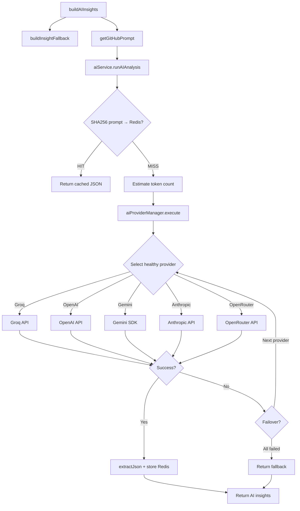

# GitHub Analyzer — Full System Flow & UI Implementation

> Complete end-to-end walkthrough from UI input to AI response and back, including every component, service, API call, cache layer, AI pipeline, database model, and UI section.

---

## Table of Contents
1. [Architecture Overview](#architecture-overview)
2. [Complete Request Flow](#complete-request-flow)
3. [Frontend Layer](#frontend-layer)
4. [Backend Layer](#backend-layer)
5. [AI Pipeline](#ai-pipeline)
6. [Database Layer](#database-layer)
7. [UI Section-by-Section Implementation](#ui-section-by-section-implementation)
8. [File Index](#file-index)

---

## Architecture Overview

```
┌──────────────────────────────────────────────────────────────────────┐
│  BROWSER                                                             │
│  ┌──────────────────────────────────────────────────────────────┐    │
│  │  GithubAnalyzerComponent (standalone Angular 21 component)    │    │
│  │  TS: github-analyzer.component.ts                            │    │
│  │  HTML: github-analyzer.component.html                         │    │
│  │  SCSS: github-analyzer.component.scss                         │    │
│  └───────────────────────┬──────────────────────────────────────┘    │
│                          │ HttpClient                                 │
│  ┌───────────────────────▼──────────────────────────────────────┐    │
│  │  GithubService (frontend/src/app/shared/services/)            │    │
│  │  - analyzeProfile()    → POST /api/github/analyze             │    │
│  │  - analyzeAndSave()    → POST /api/github/analyze-save        │    │
│  │  - getActiveUsername() → GET  /api/github/active-username     │    │
│  │  - Frontend memory cache (24h TTL) + inflight dedup          │    │
│  └───────────────────────┬──────────────────────────────────────┘    │
└──────────────────────────┼───────────────────────────────────────────┘
                           │ AuthInterceptor attaches Bearer JWT
                           │ proxy.conf.json forwards /api/* → :5000
┌──────────────────────────▼───────────────────────────────────────────┐
│  EXPRESS 5 SERVER :5000                                               │
│  ┌──────────────────────────────────────────────────────────────┐    │
│  │  Middleware Pipeline (in order)                               │    │
│  │  Helmet → CORS → Rate Limiter → Request Context → JSON Parser │    │
│  │  → Maintenance Check → Uploads Static → Metrics → Logger →   │    │
│  │  Audit Log → Auth (protect) → Authorize Roles → Org Middleware│    │
│  └───────────────────────┬──────────────────────────────────────┘    │
│                          │                                            │
│  ┌───────────────────────▼──────────────────────────────────────┐    │
│  │  GitHub Routes (backend/src/routes/github.routes.js)          │    │
│  │  POST /api/github/analyze        → analyzeGitHub (public)     │    │
│  │  POST /api/github/analyze-save   → analyzeAndSaveGitHubProfile│    │
│  │  GET  /api/github/active-username → getActiveUsername         │    │
│  └───────────────────────┬──────────────────────────────────────┘    │
│                          │                                            │
│  ┌───────────────────────▼──────────────────────────────────────┐    │
│  │  GitHub Controller (backend/src/controllers/githubcontroller) │    │
│  │  - Extracts username from req.body                            │    │
│  │  - Resolves forceRefresh from req.body/query                  │    │
│  │  - For analyze-save: validates against activeGithubUsername   │    │
│  │  - Calls githubservice.analyzeGitHubProfile()                 │    │
│  │  - For analyze-save: persists to Repository, Analysis, User   │    │
│  │  - Sends notification, invalidates dashboard cache            │    │
│  └───────────────────────┬──────────────────────────────────────┘    │
│                          │                                            │
│  ┌───────────────────────▼──────────────────────────────────────┐    │
│  │  GitHub Service (backend/src/services/githubservice.js)       │    │
│  │  ┌─────────────────────────────────────────────────────────┐  │    │
│  │  │ analyzeGitHubProfile(username, options)                  │  │    │
│  │  │  1. Check GitHubAnalysisCache (MongoDB)                  │  │    │
│  │  │  2. If fresh cache hit → return cached result            │  │    │
│  │  │  3. If miss/forceRefresh → buildFreshAnalysis()          │  │    │
│  │  │  4. Save to cache, return result                         │  │    │
│  │  │  5. On rate limit + stale cache → return stale result    │  │    │
│  │  └─────────────────────────────────────────────────────────┘  │    │
│  │  ┌─────────────────────────────────────────────────────────┐  │    │
│  │  │ buildFreshAnalysis(username)                              │  │    │
│  │  │  PHASE 1 — GitHub API Fetch:                              │  │    │
│  │  │    fetchGitHubUser()        → /users/:username            │  │    │
│  │  │    fetchGitHubRepos()       → /users/:username/repos      │  │    │
│  │  │                                                           │  │    │
│  │  │  PHASE 2 — Deep Repo Analysis (top 12 repos):              │  │    │
│  │  │    fetchRepoCommitCount()   → /repos/:owner/:repo/contributors│  │
│  │  │    buildLanguageDistribution() → /repos/:owner/:repo/languages││
│  │  │    fetchRepoCheapSignals()  → README.md + 12 manifest files │  │
│  │  │                                                           │  │    │
│  │  │  PHASE 3 — Technology Detection:                           │  │    │
│  │  │    detectTechnologies() scans repo name, description,      │  │    │
│  │  │    topics, README, manifests against TECH_CATALOG (48 tech)│  │    │
│  │  │                                                           │  │    │
│  │  │  PHASE 4 — Deterministic Scoring:                          │  │    │
│  │  │    buildRepoQuality()      → per-repo 0-100 score          │  │    │
│  │  │    categorizeRepository()  → Production/Open Source/etc    │  │    │
│  │  │    buildDeterministicScores() → 9 composite scores:        │  │    │
│  │  │      codeQuality, projectDiversity, originality,           │  │    │
│  │  │      contribution, consistency, projectImpact,             │  │    │
│  │  │      skillCoverage, profileStrength, healthScore           │  │    │
│  │  │                                                           │  │    │
│  │  │  PHASE 5 — AI Insights / Fallback:                         │  │    │
│  │  │    buildAIInsights() → AIService.runAIAnalysis()           │  │    │
│  │  │    buildRecruiterInsights()                                │  │    │
│  │  │    buildWeakAreas()                                        │  │    │
│  │  │    deriveDeveloperLevel()                                  │  │    │
│  │  │                                                           │  │    │
│  │  │  PHASE 6 — Assemble Result Object:                         │  │    │
│  │  │    scores, repos, languages, technologies, insights,       │  │    │
│  │  │    githubSignals, recruiterInsights, analysisHistory        │  │    │
│  │  └─────────────────────────────────────────────────────────┘  │    │
│  └───────────────────────┬──────────────────────────────────────┘    │
└──────────────────────────┼───────────────────────────────────────────┘
                           │
┌──────────────────────────▼───────────────────────────────────────────┐
│  AI PIPELINE                                                          │
│  ┌──────────────────────────────────────────────────────────────┐    │
│  │  githubPrompt.js → getGitHubPrompt(githubData)                │    │
│  │  Builds compact prompt with:                                  │    │
│  │  - Profile (username, bio, publicRepos, followers)            │    │
│  │  - Deterministic scores (all 9 metrics)                       │    │
│  │  - Top 8 repos with quality, tech, stars, forks               │    │
│  │  - Language distribution summary                              │    │
│  │  - Technology summary (top 16)                                │    │
│  │  - Activity metrics (repoCount, stars, forks, activeRepos)    │    │
│  │  - Weak area hints                                            │    │
│  └───────────────────────┬──────────────────────────────────────┘    │
│                          │                                            │
│  ┌───────────────────────▼──────────────────────────────────────┐    │
│  │  AIService.runAIAnalysis(prompt, fallback)                    │    │
│  │  1. SHA256(prompt) → check Redis prompt cache                 │    │
│  │  2. If cache hit → return cached JSON                         │    │
│  │  3. Estimate prompt size (~ tokens)                           │    │
│  │  4. Call AIProviderManager.execute(prompt)                    │    │
│  └───────────────────────┬──────────────────────────────────────┘    │
│                          │                                            │
│  ┌───────────────────────▼──────────────────────────────────────┐    │
│  │  AIProviderManager.execute(prompt)                             │    │
│  │  1. Select healthy provider by AI_PROVIDER_PRIORITY order     │    │
│  │  2. Route to correct SDK based on provider name:              │    │
│  │     Groq      → OpenAI-compat endpoint                        │    │
│  │     OpenAI    → OpenAI chat completions                       │    │
│  │     Gemini    → @google/generative-ai SDK                     │    │
│  │     Anthropic → Anthropic Messages API                        │    │
│  │     OpenRouter→ OpenAI-compat endpoint                        │    │
│  │  3. On transient failure (429, 500-504, timeout):             │    │
│  │     → cooldown provider, failover to next                     │    │
│  │  4. On permanent failure (400, 401, 403, 404, 413):           │    │
│  │     → failover immediately                                    │    │
│  │  5. Return raw AI response text                               │    │
│  └───────────────────────┬──────────────────────────────────────┘    │
│                          │                                            │
│  ┌───────────────────────▼──────────────────────────────────────┐    │
│  │  AIService post-processing:                                    │    │
│  │  1. extractJson() — strip fences → JSON.parse → repair        │    │
│  │  2. Store parsed JSON in Redis (key: ai:response:<sha256>)    │    │
│  │  3. Return parsed object                                      │    │
│  │  On error → return fallback object (deterministic insights)   │    │
│  └──────────────────────────────────────────────────────────────┘    │
└──────────────────────────────────────────────────────────────────────┘
                           │
┌──────────────────────────▼───────────────────────────────────────────┐
│  DATA STORES                                                          │
│  ┌──────────────────────────────────────────────────────────────┐    │
│  │  MongoDB Collections:                                         │    │
│  │  ┌─────────────────────────────────────────────────────────┐  │    │
│  │  │ GitHubAnalysisCache                                      │  │    │
│  │  │ - normalizedUsername (indexed, unique with version)      │  │    │
│  │  │ - analysisVersion: "github-v2"                           │  │    │
│  │  │ - result: full analysis result object                    │  │    │
│  │  │ - snapshots[]: last 12 historical snapshots              │  │    │
│  │  │ - expiresAt: TTL (24h), indexed                         │  │    │
│  │  │ Used for: public preview + stale-while-revalidate        │  │    │
│  │  └─────────────────────────────────────────────────────────┘  │    │
│  │  ┌─────────────────────────────────────────────────────────┐  │    │
│  │  │ Analysis (per-user)                                      │  │    │
│  │  │ - githubScore, githubStats, githubSignals                │  │    │
│  │  │ - languageDistribution (Map)                             │  │    │
│  │  │ - contributionActivity[], githubAnalysisHistory[]        │  │    │
│  │  │ Used for: saved profile, dashboard, skill gap, reports   │  │    │
│  │  └─────────────────────────────────────────────────────────┘  │    │
│  │  ┌─────────────────────────────────────────────────────────┐  │    │
│  │  │ Repository (per-user)                                    │  │    │
│  │  │ - repoName, language, stars, forks, commits, ownerId     │  │    │
│  │  │ Used for: saved repo persistence                         │  │    │
│  │  └─────────────────────────────────────────────────────────┘  │    │
│  └──────────────────────────────────────────────────────────────┘    │
│  ┌──────────────────────────────────────────────────────────────┐    │
│  │  Redis Cache:                                                 │    │
│  │  - ai:response:<sha256(prompt)>    → parsed AI JSON result    │    │
│  │  - ai:deterministic:<sha256>       → deterministic summaries  │    │
│  │  - lock:github_swr:<username>      → SWR refresh lock         │    │
│  └──────────────────────────────────────────────────────────────┘    │
└──────────────────────────────────────────────────────────────────────┘
```

---

## Complete Request Flow (Sequence)

```
USER enters username "alexdev" in input field
  │
  ├──[Enter key or "Analyze Profile" button click]
  │
  ▼
GithubAnalyzerComponent.analyze(forceRefresh=false)
  │  1. trim "@" prefix, normalize case
  │  2. Compare with defaultUsername → determine mode: "public" or "save"
  │  3. Build requestKey for dedup: "save:alexdev:normal"
  │  4. Check GithubService memory cache (getCachedAnalysis)
  │     → If hit: immediately applyResult(), render UI (optimistic)
  │     → Then fire actual HTTP request anyway
  │
  ▼
GithubService.analyzeProfile() or .analyzeAndSave()
  │  1. Check inflight Map for duplicate request
  │     → If already in-flight, return shared Observable (shareReplay)
  │  2. Check memory cache again (cachedRequest)
  │     → 24h TTL, mode + username key
  │     → If valid cache + no forceRefresh → return of(cached)
  │
  ▼
HTTP POST to /api/github/analyze (or /api/github/analyze-save)
  │  AuthInterceptor attaches: Authorization: Bearer <JWT>
  │  Body: { username: "alexdev", forceRefresh: false }
  │
  ├──[DEV: proxy.conf.json → localhost:5000]
  │
  ▼
Express Middleware Pipeline
  │  helmet → cors → rateLimiter → requestContext → JSON parse
  │  → maintenance → uploads → metrics → logger → audit → auth
  │
  ▼
github.routes.js → POST /analyze → analyzeGitHub controller
  │
  ▼
githubcontroller.analyzeGitHub(req, res)
  │  1. Validate username exists + trimmed
  │  2. Parse forceRefresh from body/query
  │  3. Call githubservice.analyzeGitHubProfile(username, {forceRefresh})
  │  4. Return res.json(data) or res.status(429/500)
  │
  ▼
githubservice.analyzeGitHubProfile(username, {forceRefresh})
  │
  ├─ STEP 1: Check MongoDB cache
  │   getCacheEntry(username) → GitHubAnalysisCache.findOne()
  │   If fresh (expiresAt > now) AND !forceRefresh:
  │     → return withCacheMetadata(cached.result, cacheEntry, 'cache')
  │
  ├─ STEP 2: Build fresh analysis
  │   buildFreshAnalysis(username)
  │   │
  │   ├─ A. Fetch GitHub user + repos (parallel)
  │   │     fetchGitHubUser(username)        → GET /users/:username
  │   │     fetchGitHubRepos(username)        → GET /users/:username/repos (100 per_page)
  │   │     Uses GITHUB_TOKEN from env or platform settings for auth
  │   │     Checks x-ratelimit-remaining header
  │   │
  │   ├─ B. If no repos: return empty result (all zeros)
  │   │
  │   ├─ C. Rank repos by stars+forks, select top 12
  │   │
  │   ├─ D. Deep analysis (parallel)
  │   │     fetchRepoCommitCount() per repo   → GET /repos/:owner/:repo/contributors
  │   │     buildLanguageDistribution()       → GET /repos/:owner/:repo/languages (top 24 repos)
  │   │     fetchRepoCheapSignals()            → README.md + 12 manifest files (top 8 repos)
  │   │       • package.json, requirements.txt, pyproject.toml, go.mod, pom.xml
  │   │       • build.gradle, Gemfile, composer.json, Dockerfile, CI workflows
  │   │
  │   ├─ E. Technology Detection
  │   │     detectTechnologies({repos, languageDistribution, repoSignals})
  │   │     • Maps GitHub languages to categories (JavaScript→Frontend, Python→Backend, etc.)
  │   │     • Scans repo name, description, topics, README, manifests
  │   │     • Matches against TECH_CATALOG (48 technologies across 8 categories)
  │   │     • Categories: Frontend, Backend, Database, DevOps, Cloud, Testing, Mobile, AI/ML
  │   │     • Returns: technologies[], technologyCategories{}, technologyDistribution[]
  │   │
  │   ├─ F. Per-Repository Scoring
  │   │     For each repo:
  │   │     buildRepoQuality() → weighted 0-100 score using:
  │   │       readmeScore (20%) + descriptionScore (12%) + topicScore (10%)
  │   │       + starSignal (12%) + forkSignal (8%) + commitSignal (18%)
  │   │       + recencySignal (13%) + sizeSignal (4%) + techSignal (3%)
  │   │     categorizeRepository() → Production / Open Source / Portfolio / Learning / Archived / Experimental
  │   │     Based on: stars≥25|forks≥8, qualityScore≥72+commits≥20+techs≥2, keyword matching
  │   │
  │   ├─ G. Deterministic Composite Scores
  │   │     buildDeterministicScores() computes:
  │   │     ┌─────────────────────┬──────────────────────────────────────────┐
  │   │     │ codeQuality         │ avgRepoQuality(62%) + readme(18%) + tech │
  │   │     │ projectDiversity    │ diversity(48%) + tech(42%) + repos(10%)   │
  │   │     │ originality         │ stars(35%) + forks(20%) + quality(25%)   │
  │   │     │ contribution        │ commits(70%) + activity(30%)             │
  │   │     │ consistency         │ = activitySignal (active repos ratio)    │
  │   │     │ projectImpact       │ stars(34%) + forks(20%) + repos(16%)     │
  │   │     │ skillCoverage       │ diversity(45%) + tech(55%)               │
  │   │     │ profileStrength     │ repos(28%) + followers(18%) + stars(20%) │
  │   │     │ healthScore (final) │ codeQuality(24%) + diversity(17%)        │
  │   │     │                     │ + contribution(18%) + activity(13%)      │
  │   │     │                     │ + impact(14%) + profileStrength(14%)     │
  │   │     └─────────────────────┴──────────────────────────────────────────┘
  │   │     All scores use log-scale clamping for stars, forks, followers, commits
  │   │
  │   ├─ H. Weak Areas (deterministic)
  │   │     buildWeakAreas() checks: missing READMEs, no descriptions,
  │   │     low quality repos, low contribution, missing Testing/DevOps,
  │   │     support-language dominance
  │   │
  │   ├─ I. Developer Level
  │   │     deriveDeveloperLevel() → Beginner / Intermediate / Advanced
  │   │     Based on: healthScore≥78+repos≥8+techs≥8 → Advanced
  │   │
  │   ├─ J. AI Insights (optional, with deterministic fallback)
  │   │     buildAIInsights({username, userData, repos, languageSummary,
  │   │                      technologySummary, activityMetrics, deterministicScores, weakAreas})
  │   │     │
  │   │     ├─ Build fallback: buildInsightFallback({developerLevel, strongestRepos, weakAreas})
  │   │     │
  │   │     ├─ Build prompt: getGitHubPrompt({username, profile, deterministicScores,
  │   │     │   topRepos, languageSummary, technologySummary, activityMetrics, weakAreaHints})
  │   │     │   → compactJson() via promptBuilderService to stay under 5000 tokens
  │   │     │
  │   │     ├─ Call AI: aiService.runAIAnalysis(prompt, fallback)
  │   │     │   │
  │   │     │   ├─ SHA256(prompt) → check Redis: ai:response:<hash>
  │   │     │   │   → Cache HIT: return cached parsed JSON
  │   │     │   │
  │   │     │   ├─ Redis MISS: estimate prompt tokens → provider manager
  │   │     │   │
  │   │     │   ├─ AIProviderManager.execute(prompt)
  │   │     │   │   ├─ Select provider by AI_PROVIDER_PRIORITY
  │   │     │   │   ├─ Call provider SDK (Groq → OpenAI → Gemini → Anthropic → OpenRouter)
  │   │     │   │   ├─ On transient failure: cooldown, failover to next
  │   │     │   │   └─ Return raw AI response text
  │   │     │   │
  │   │     │   ├─ extractJson(rawText) → strip fences → JSON.parse → repair
  │   │     │   │
  │   │     │   ├─ Store in Redis: ai:response:<hash> = parsed JSON
  │   │     │   │
  │   │     │   └─ Return parsed JSON (developerLevel, strengths[], weakAreas[], summary, explanation)
  │   │     │
  │   │     └─ AI returns developerLevel, strengths[3-6], weakAreas[3-6], summary, explanation
  │   │        On failure → fallback returned (rule-based insights)
  │   │
  │   ├─ K. Recruiter Insights
  │   │     buildRecruiterInsights() generates:
  │   │     - headline (tiered by healthScore: Strong / Promising / Early)
  │   │     - proofPoints[] (top tech, production repos, stars/followers validation)
  │   │     - recruiterSummary (repo count + health score)
  │   │     - interviewTalkingPoints[] (archive discussions + tech demos)
  │   │
  │   └─ L. Build githubSignals object (all signals condensed for cross-feature use)
  │
  ├─ STEP 3: Save to MongoDB cache
  │   saveCacheResult(username, result, previousEntry)
  │   → GitHubAnalysisCache.findOneAndUpdate(upsert)
  │   → Stores full result + pushes snapshot to snapshots[] (keep last 12)
  │
  └─ STEP 4: Return withCacheMetadata(result, cacheEntry, 'fresh')
       Includes: analysisVersion, cache.source, cache.expiresAt, cache.cachedAt,
                 analysisHistory (last 6 snapshots), comparison (delta from previous)
  │
  ├──[If analyze-save path: additional persistence]
  │   ├─ Delete old: Repository.deleteMany({ownerId})
  │   ├─ Insert new: Repository.insertMany(repos[])
  │   ├─ Upsert Analysis: githubScore, githubStats, githubSignals,
  │   │   languageDistribution, contributionActivity, githubAnalysisHistory[] (last 12)
  │   ├─ Update User: githubUsername, activeGithubUsername
  │   ├─ Create notification: type "github_update", 1h dedup window
  │   └─ Invalidate dashboard cache: invalidateDashboardSummaryCache()
  │
  ▼
Response flows back: Controller → Middleware → HTTP Response
  │
  ▼
GithubService receives response
  │  tap() stores in memory cache (24h TTL)
  │  finalize() removes from inflight Map
  │
  ▼
GithubAnalyzerComponent.applyResult(data, username, isDefaultProfileAnalysis)
  │  1. Set this.result = data
  │  2. Set isTemporaryView = !isDefaultProfileAnalysis
  │  3. Format lastAnalyzedLabel from cache.cachedAt or githubSignals.analyzedAt
  │  4. Set cacheStatusLabel: "Cached" / "Fresh" / "Cached fallback"
  │  5. Set pendingLangs = displayLanguages, pendingActivity = repositoryActivity
  │  6. Trigger ChangeDetectorRef.detectChanges()
  │  7. setTimeout → flushPendingCharts()
  │
  ▼
flushPendingCharts()
  ├─ buildDonutChart(langs[])  → Chart.js doughnut on #donutCanvas
  │   • Colors from LANG_COLOURS array (10 colors)
  │   • cutout: 68%, responsive, no legend
  │   • Tooltip: "Language: XX%"
  │
  └─ buildBarChart(activity[]) → Chart.js horizontal bar on #barCanvas
      • Top 7 repos by commits, sorted descending
      • barThickness: 16, borderRadius: 4
      • Dark theme: grid rgba(255,255,255,0.05), ticks #94A3B8
  │
  ▼
UI RENDERS all sections (see UI Section-by-Section below)
```

---

## Frontend Layer

### Route Registration
**File**: `frontend/src/app/app.routes.ts`
```typescript
{ path: 'github-analyzer', component: GithubAnalyzerComponent }
```
- Protected by `authGuard` (must be authenticated)
- Rendered inside `MainLayout` → `<router-outlet>`
- Route: `/app/github-analyzer`

### Sidebar Navigation
**File**: `frontend/src/app/layout/main-layout/sidebar/sidebar.ts`
```typescript
{ type: 'page', label: 'GitHub Analyzer', sublabel: 'Analyze GitHub repositories',
  route: '/app/github-analyzer', icon: '<svg>GitHub logo</svg>' }
```

### GithubAnalyzerComponent
**File**: `frontend/src/app/pages/github-analyzer/github-analyzer.component.ts`

**Lifecycle:**
1. `ngOnInit()`:
   - Check `authService.getCurrentUser()` for stored `activeGithubUsername`
   - If found → apply as default, auto-analyze
   - If not → call `github.getActiveUsername()` → apply result, auto-analyze
2. `ngAfterViewInit()`: Set `viewReady = true`, flush pending chart renders
3. `ngOnDestroy()`: Destroy Chart.js instances

**Key Methods:**
| Method | Purpose |
|--------|---------|
| `analyze(forceRefresh)` | Core analysis trigger. Determines public vs save mode. Checks frontend cache, fires HTTP request, handles response |
| `refreshAnalysis()` | Calls `analyze(true)` for force refresh |
| `returnToDefaultProfile()` | Resets to default username, re-analyzes |
| `applyResult()` | Sets result state, triggers CD, schedules chart render |
| `flushPendingCharts()` | Renders donut + bar charts if viewReady + analysisReady |
| `buildDonutChart(langs)` | Chart.js doughnut — language distribution |
| `buildBarChart(activity)` | Chart.js horizontal bar — commit activity |
| `destroyCharts()` | Destroys Chart.js instances to prevent memory leaks |

**Computed Properties (Getters):**
| Getter | Returns |
|--------|---------|
| `displayLanguages` | `mainLanguageDistribution` (fallback to `languageDistribution`) |
| `supportLanguages` | `supportLanguageDistribution` |
| `topTechnologies` | First 16 detected technologies |
| `technologyCategories` | Grouped by category (Frontend, Backend, etc.) |
| `repositoryRows` | Repositories sorted by qualityScore descending |
| `healthScore` | Numeric health score (0-100) |
| `hasChartData` | Whether languages or activity data exists |
| `getScoreClass(score)` | 'score-high' (≥80), 'score-mid' (≥50), 'score-low' (<50) |
| `getScoreBarWidth(score)` | CSS width percentage for score bars |

### GithubService
**File**: `frontend/src/app/shared/services/github.service.ts`

**Caching Strategy:**
- **Memory cache**: `Map<string, {result, expiresAt}>` with 24h TTL (matching backend)
- **Inflight dedup**: `Map<string, Observable>` — reuses in-flight requests via `shareReplay`
- **Cache key format**: `{mode}:{normalizedUsername}` (e.g., `public:alexdev`, `save:alexdev`)
- **On analyzeAndSave**: Clears `frontendCache.clearCurrentSignalHash()` (invalidates signal-dependent caches)

**Endpoints:**
| Method | HTTP | Endpoint | Cache Strategy |
|--------|------|----------|----------------|
| `analyzeProfile()` | POST | `/api/github/analyze` | Memory + inflight dedup |
| `analyzeAndSave()` | POST | `/api/github/analyze-save` | Memory + inflight dedup + clears signal hash |
| `getActiveUsername()` | GET | `/api/github/active-username` | No caching |

**HTTP Interceptors Applied:**
- `AuthInterceptor`: Adds `Authorization: Bearer <token>` header
- `ErrorInterceptor`: Catches 401 → clears token, redirects to login

### FrontendAnalysisCacheService
**File**: `frontend/src/app/shared/services/frontend-analysis-cache.service.ts`
- Cleared when `analyzeAndSave()` is called to bust stale signal hashes
- Used by dashboard and other cross-feature components

---

## Backend Layer

### Route → Controller → Service Pattern

```
github.routes.js                    githubcontroller.js             githubservice.js
─────────────────                   ────────────────────            ─────────────────
POST /analyze                       analyzeGitHub()                 analyzeGitHubProfile()
  → githubController.analyzeGitHub    → validates username            → checks MongoDB cache
                                      → calls service                → builds fresh analysis
                                      → returns JSON                 → saves to cache
                                                                     → returns result

POST /analyze-save                  analyzeAndSaveGitHubProfile()   
  → protect middleware                → validates active username
  → githubController.analyzeAndSave   → calls service
                                      → persists Repository[]
                                      → upserts Analysis
                                      → updates User
                                      → creates notification
                                      → invalidates dashboard

GET /active-username                getActiveUsername()
  → protect middleware                → reads User.activeGithubUsername
  → githubController.getActiveUser    → returns { username, isDefault, activeUsername }
```

### GitHub API Integration
**File**: `backend/src/services/githubservice.js`

**API Client:**
- Uses `axios` with 10s timeout
- Injects `GITHUB_TOKEN` from env or platform settings (`getIntegrationSecretsSync()`)
- Checks `x-ratelimit-remaining` header on every response
- Throws `GitHubRateLimitError` on 403/429 or rate limit message

**API Calls Made (per analysis):**
| Call | Endpoint | Per |
|------|----------|-----|
| User profile | `GET /users/:username` | 1 |
| Repositories | `GET /users/:username/repos?per_page=100&sort=updated&type=owner` | 1 |
| Languages | `GET /repos/:owner/:repo/languages` | Up to 24 repos (top, non-fork) |
| Commits | `GET /repos/:owner/:repo/contributors?per_page=100` | Up to 12 repos |
| Content (README + manifests) | `GET /repos/:owner/:repo/contents/:path` | Up to 8 repos × 13 files = 104 max |
| Monthly commits | `GET /repos/:owner/:repo/commits?since&until&per_page=100&page=1-4` | Up to 12 active repos × up to 4 pages |

**Rate Limit Protection:**
- `assertRateLimit(headers)` — throws if remaining === 0
- On rate limit during `buildFreshAnalysis`: returns stale cache if available
- Frontend sees `result.rateLimited: true` + `result.warning` message

### Deterministic Scoring System

All scores are 0-100, computed mathematically without AI dependency.

**Per-Repository Quality Score** (`buildRepoQuality`):
| Component | Weight | Formula |
|-----------|--------|---------|
| README | 20% | `clamp((readmeLength/1800)*100, 35, 100)` if has README, else 10 |
| Description | 12% | 100 if has description, else 20 |
| Topics | 10% | `clamp((topicCount/5)*100)` |
| Star Signal | 12% | `clamp((log10(stars+1)/1.7)*100)` |
| Fork Signal | 8% | `clamp((log10(forks+1)/1.5)*100)` |
| Commit Signal | 18% | `clamp((log10(commits+1)/2.3)*100)` |
| Recency | 13% | `clamp(100 - min(100, (daysOld/365)*100))` |
| Size | 4% | tiered: 0→10, <50→35, <50000→85, else→70 |
| Tech Signal | 3% | `clamp((techCount/4)*100)` |

**Level Derivation:**
- **Advanced**: healthScore ≥ 78 AND repos ≥ 8 AND techs ≥ 8
- **Intermediate**: healthScore ≥ 45 OR repos ≥ 4 OR stars ≥ 5
- **Beginner**: otherwise

**Repository Categorization:**
- **Archived**: repo.archived = true
- **Open Source**: stars ≥ 25 OR forks ≥ 8 OR keywords ("open-source", "library", "package")
- **Production**: qualityScore ≥ 72 AND commits ≥ 20 AND techs ≥ 2
- **Portfolio**: keywords ("portfolio", "resume", "personal")
- **Learning**: keywords ("learn", "tutorial", "practice", "course")
- **Experimental**: qualityScore < 45

### Cache System (Stale-While-Revalidate)

**File**: `backend/src/services/githubservice.js`

```
analyzeGitHubProfile(username, {forceRefresh})
  │
  ├─ getCacheEntry(username) → GitHubAnalysisCache.findOne()
  │
  ├─ IF fresh cache && !forceRefresh:
  │     return withCacheMetadata(cachedResult, cacheEntry, 'cache')
  │
  ├─ TRY buildFreshAnalysis(username):
  │     → saveCacheResult(username, fresh, previousEntry)
  │     → return withCacheMetadata(fresh, updated, 'fresh')
  │
  └─ CATCH rateLimitError:
        IF stale cache exists:
          → return withCacheMetadata(staleResult, cacheEntry, 'stale-cache')
          + rateLimited: true, warning: "Showing most recent cached analysis"
```

**Background Refresh (SWR)** — `refreshGitHubAnalysisInBackground()`:
Used by Skill Gap feature to keep cache warm:
1. Dedup check: only one refresh per username (in-memory Map + Redis lock)
2. Redis distributed lock: `lock:github_swr:<username>` (20 min TTL)
3. Builds fresh analysis, saves cache, invalidates skill gap caches
4. Thread-safe with `finally` cleanup

---

## AI Pipeline

### Prompt Construction
**File**: `backend/src/prompts/githubPrompt.js`

```javascript
// Input: compacted GitHub evidence via promptBuilderService.compactJson()
// Returns structured prompt asking for:
// 1. developerLevel: "Beginner" | "Intermediate" | "Advanced"
// 2. strengths: 3-6 recruiter-friendly technical strengths
// 3. weakAreas: 3-6 specific improvement areas
// 4. summary: Recruiter-friendly profile summary
// 5. explanation: Concise explanation of score drivers
```

**Prompt Context Includes:**
- Username and bio
- Public repos count, followers count
- All 9 deterministic scores
- Top 8 repos with quality scores, technologies, stars, forks
- Language distribution summary
- Technology summary (top 16)
- Activity metrics
- Weak area hints

### AI Flow
**File**: `backend/src/services/aiservice.js` + `backend/src/services/aiProviderManager.js`



**Provider Priority**: Configured via `AI_PROVIDER_PRIORITY` env (default: `groq,openai,gemini,anthropic,openrouter`)

**Retry Policy:**
- **Transient** (retryable): timeout, 429, 500, 502, 503, 504
- **Permanent** (failover immediate): 400, 401, 403, 404, 413
- **429** triggers provider cooldown + switch

**JSON Extraction** (`extractJson`):
1. Strip markdown code fences (\`\`\`json / \`\`\`)
2. Attempt direct `JSON.parse()`
3. Regex extract outermost `{...}` or `[...]`
4. Attempt parse
5. If fails: `repairJson()` — close unclosed braces/brackets, strip trailing commas
6. If all fails: throw → fallback returned

### Fallback Strategy
```javascript
// Every AI call has a deterministic fallback
const fallback = buildInsightFallback({developerLevel, strongestRepos, weakAreas});
const aiResult = await aiService.runAIAnalysis(prompt, fallback);

// Fallback provides:
// - developerLevel (from deterministic scoring)
// - strengths: "Strong project signal in {repo.name}" for top 3
// - weakAreas: rule-based warnings
// - summary: "Rule-based GitHub analysis completed"
// - explanation: generic score driver description
```

---

## Database Layer

### GitHubAnalysisCache (MongoDB)
**File**: `backend/src/models/githubAnalysisCache.js`

| Field | Type | Notes |
|-------|------|-------|
| `githubUsername` | String | Original casing |
| `normalizedUsername` | String | Lowercase, trimmed — **unique index** with analysisVersion |
| `analysisVersion` | String | Currently `"github-v2"` |
| `result` | Mixed | Full analysis result object |
| `snapshots[]` | Array | Last 12 historical snapshots (analyzedAt, healthScore, repoCount, stars, forks, followers, topLanguages, topTechnologies) |
| `expiresAt` | Date | 24h TTL from creation — **indexed** |
| `createdAt` / `updatedAt` | Date | Mongoose timestamps |

**Indexes:**
- `{normalizedUsername: 1, analysisVersion: 1}` — **unique** (one cache entry per username+version)
- `{expiresAt: 1}` — for TTL queries (non-MongoDB-TTL, manually managed)

### Analysis (per-user)
**File**: `backend/src/models/analysis.js`

| Field | Type | Purpose |
|-------|------|---------|
| `userId` | ObjectId → User | Owner |
| `githubScore` | Number | Saved health score |
| `githubStats` | {repos, stars, forks, followers} | Quick stats |
| `githubAnalysisVersion` | String | Version tag |
| `githubSignals` | Mixed | All signals for cross-feature use |
| `githubAnalysisHistory[]` | Array | Last 12 snapshots for trend |
| `languageDistribution` | Map<String, Number> | Language → percentage |
| `contributionActivity[]` | [{month, count}] | Monthly commit data |

### Repository (per-user)
**File**: `backend/src/models/repository.js`

| Field | Type | Purpose |
|-------|------|---------|
| `ownerId` | ObjectId → User | Owner |
| `repoName` | String | Repository name |
| `language` | String | Primary language |
| `stars` | Number | Star count |
| `forks` | Number | Fork count |
| `commits` | Number | Commit count |
| `lastUpdated` | Date | Last update time |

### Redis Cache
| Key Pattern | Content | TTL |
|-------------|---------|-----|
| `ai:response:<sha256>` | Parsed AI JSON result | `AI_RESPONSE_CACHE_TTL_SECONDS` (default 86400s) |
| `ai:deterministic:<sha256>` | Deterministic summary | `AI_DETERMINISTIC_CACHE_TTL_SECONDS` (default 600s) |
| `lock:github_swr:<username>` | SWR refresh distributed lock | 20 minutes |

---

## UI Section-by-Section Implementation

### 1. Page Header
```html
<div class="page-header">
  <div>
    <h2 class="page-title">GitHub Analyzer</h2>
    <p class="page-subtitle">Repository quality, technology signals, and recruiter-ready insights</p>
  </div>
  <button class="ghost-btn" (click)="refreshAnalysis()" [disabled]="isAnalyzing">
    Refresh analysis
  </button>
</div>
```
**SCSS**: Flexbox row, `justify-content: space-between`. Title 1.75rem/700. Subtitle 0.875rem, color `#94a3b8`. Ghost button with border, hover border glow.

### 2. Search Card
```html
<div class="search-card">
  <div class="search-inner">
    <div class="search-input-wrap">
      <span class="search-prefix-icon">GH</span>
      <span class="search-prefix-text">github.com/</span>
      <input class="search-input" placeholder="alexdev"
             [(ngModel)]="username" (keyup.enter)="analyze(false)" />
    </div>
    <button class="analyze-btn" (click)="analyze(false)"
            [disabled]="!username.trim() || isAnalyzing">
      {{ isAnalyzing ? 'Analyzing...' : 'Analyze Profile' }}
    </button>
  </div>
  <!-- Error banner: red background, red border -->
  <!-- Notice banner: blue background, shows temp/default status + last analyzed + cache status -->
</div>
```
**SCSS**: Card bg `#131929`, border `rgba(255,255,255,0.08)`. Input wrap: `flex:1`, height 44px, dark background `rgba(255,255,255,0.04)`, focus ring blue `rgba(37,99,235,0.6)`. Prefix: grey `#64748b`, pipe-separated. Button: blue `#2563eb`, 44px height, white text, 700 weight. Error: `rgba(239,68,68,0.12)` bg. Notice: `rgba(37,99,235,0.12)` bg.

### 3. Overview Grid
```html
<section class="overview-grid">
  <!-- SCORE PANEL: Spans 2fr, flex row -->
  <div class="score-panel">
    <div class="score-ring" [ngClass]="getScoreClass(healthScore)">
      <span>{{ healthScore }}</span>
      <small>/100</small>
    </div>
    <div>
      <p class="section-kicker">GitHub Health Score</p>
      <h3>{{ recruiterInsights?.headline || developerLevel }}</h3>
      <p>{{ summary || explanation || recruiterSummary }}</p>
    </div>
  </div>
  <!-- STAT CARDS: 4 equal columns -->
  <div class="stat-card"><p>Repositories</p><p class="stat-value">{{ repoCount }}</p></div>
  <div class="stat-card"><p>Stars</p><p class="stat-value">{{ totalStars }}</p></div>
  <div class="stat-card"><p>Forks</p><p class="stat-value">{{ totalForks }}</p></div>
  <div class="stat-card"><p>Followers</p><p class="stat-value">{{ followers }}</p></div>
</section>
```
**SCSS**: CSS Grid `minmax(320px, 2fr) repeat(4, minmax(120px, 1fr))`. Score ring: 96×96px, 8px border, conditional color (≥80 green, ≥50 blue, <50 amber). Stats: 18px padding, 1.55rem bold values.

**Responsive Breakpoints:**
| Width | Layout |
|-------|--------|
| >1100px | Score panel (2fr) + 4 stat cards side by side |
| ≤1100px | All in 4-column grid, score panel spans full width |
| ≤850px | 2-column grid |
| ≤560px | Single column, score panel + donut stacked vertically |

### 4. Charts Row
```html
<section class="charts-row">
  <!-- LANGUAGE DONUT CHART -->
  <div class="chart-card">
    <div class="chart-card-header">
      <h4 class="chart-title">Languages</h4>
      <p class="chart-subtitle">{{ languageSource description }}</p>
    </div>
    <div class="chart-body donut-body">
      <div class="donut-wrap"><canvas #donutCanvas></canvas></div>
      <ul class="lang-legend">
        <li class="legend-item" *ngFor="let lang of displayLanguages; let i = index">
          <span class="legend-dot" [style.background]="getLangColour(i)"></span>
          <span class="legend-name">{{ lang.language }}</span>
          <span class="legend-pct">{{ lang.percentage }}%</span>
        </li>
      </ul>
    </div>
    <div class="support-languages">Support files: ...</div>
  </div>

  <!-- COMMIT ACTIVITY BAR CHART -->
  <div class="chart-card">
    <div class="chart-card-header">
      <h4 class="chart-title">Activity</h4>
      <p class="chart-subtitle">Commit depth across strongest repositories</p>
    </div>
    <div class="chart-body bar-body"><canvas #barCanvas></canvas></div>
  </div>
</section>
```
**Chart.js Configuration:**
- **Donut**: 180×180px canvas, `cutout: '68%'`, 10-color palette (`#2563EB`, `#16A34A`, `#F59E0B`, `#DC2626`, `#7C3AED`, `#0891B2`, `#DB2777`, `#65A30D`, `#EA580C`, `#475569`). Border `#111827`, 3px width. No legend (custom HTML legend used). Tooltip: `"Language: XX%"`.
- **Bar**: Horizontal (`indexAxis: 'y'`), top 7 repos by commits, barThickness 16px, borderRadius 4px. Same color palette with CC alpha for fill. X-axis: beginsAtZero, white-semi-transparent grid lines, grey ticks. Y-axis: no grid, grey ticks, 18-char truncation.

**SCSS**: Donut body: flex row, wrap at 180px, gap 24px. Bar body: min-height 230px. Legend: grid, 9px gap, dot (10px circle) + name (truncated) + percentage (bold, right-aligned).

### 5. Technologies Detected
```html
<div class="info-section">
  <div class="section-header"><h4>Technologies Detected</h4></div>
  <div class="tech-groups">
    <div class="tech-group" *ngFor="let group of technologyCategories">
      <strong>{{ group.category }}</strong>
      <div class="pill-row">
        <span class="pill" *ngFor="let tech of group.items">{{ tech.name }}</span>
      </div>
    </div>
  </div>
</div>
```
Categories displayed: Frontend, Backend, Database, DevOps, Cloud, Testing, Mobile, AI/ML (only if items exist). Each technology rendered as a pill with blue background `rgba(37,99,235,0.14)`, blue border, blue text.

**SCSS**: Groups in grid layout, 14px gap. Category labels: `#94a3b8`, 0.82rem. Pill rows: flex-wrap, 8px gap. Pills: inline-flex, rounded-full, 3px/9px padding, 0.76rem, 700 weight.

### 6. Recruiter Insights
```html
<div class="info-section">
  <div class="section-header"><h4>Recruiter Insights</h4></div>
  <ul class="insight-list">
    <li *ngFor="let point of recruiterInsights?.proofPoints">{{ point }}</li>
  </ul>
</div>
```
Proof points include: health score assessment, production/open-source repo count, visible tech stack summary, stars/followers validation. Generated deterministically, no AI involved.

**SCSS**: List: grid layout, 10px gap, 18px left padding, `#94a3b8` color, 1.5 line-height.

### 7. Strengths & Weak Areas
```html
<section class="content-grid">
  <!-- Strengths -->
  <div class="info-section">
    <div class="section-header"><h4>Strengths</h4></div>
    <ul class="insight-list">
      <li *ngFor="let item of result.strengths">{{ item }}</li>
    </ul>
  </div>
  <!-- Weak Areas -->
  <div class="info-section">
    <div class="section-header"><h4>Weak Areas</h4></div>
    <ul class="insight-list warning-list">
      <li *ngFor="let item of result.weakAreas">{{ item }}</li>
    </ul>
  </div>
</section>
```
AI-generated (with deterministic fallback). Weak areas use amber `::marker` color (`#F59E0B`).

### 8. Repository Quality Table
```html
<section class="table-card">
  <div class="table-header">
    <div>
      <h4 class="chart-title">Repository Quality</h4>
      <p class="chart-subtitle">Quality combines README, description, topics, activity, stars, forks, size, and tech signals</p>
    </div>
    <span class="repo-count-badge">{{ repoCount }} repos analyzed</span>
  </div>
  <div class="table-wrap">
    <table class="repo-table">
      <thead>
        <tr>
          <th>Repository</th> <th>Category</th> <th>Language</th>
          <th>Tech</th> <th>Stars</th> <th>Forks</th>
          <th>Quality</th> <th></th>
        </tr>
      </thead>
      <tbody>
        <tr *ngFor="let repo of repositoryRows">
          <td class="repo-name-cell">
            <strong>{{ repo.name }}</strong>
            <small>{{ repo.description }}</small>
          </td>
          <td><span class="category-badge">{{ repo.category }}</span></td>
          <td>
            <span class="lang-badge" *ngIf="repo.language !== 'Unknown'">{{ repo.language }}</span>
            <span class="lang-badge--unknown" *ngIf="repo.language === 'Unknown'">None</span>
          </td>
          <td class="tech-cell">
            <span *ngFor="let tech of repo.technologies.slice(0,3)">{{ tech }}</span>
          </td>
          <td>{{ formatNumber(repo.stars) }}</td>
          <td>{{ formatNumber(repo.forks) }}</td>
          <td class="score-cell">
            <div class="score-bar-wrap">
              <div class="score-bar-bg">
                <div class="score-bar-fill" [ngClass]="getScoreClass(repo.qualityScore)"
                     [style.width]="getScoreBarWidth(repo.qualityScore)"></div>
              </div>
              <span class="score-num" [ngClass]="getScoreClass(repo.qualityScore)">
                {{ repo.qualityScore }}
              </span>
            </div>
          </td>
          <td>
            <a [href]="'https://github.com/' + viewedUsername + '/' + repo.name"
               target="_blank" class="ext-link">Open</a>
          </td>
        </tr>
      </tbody>
    </table>
  </div>
</section>
```
**SCSS**: Table min-width 980px (horizontal scroll). Header: uppercase, 0.74rem, `#64748b`, `rgba(255,255,255,0.03)` bg. Rows: 13px/16px padding, `rgba(255,255,255,0.05)` border-bottom. Repo name cell: grid layout with name + description. Category badge: green pill. Language badge: blue pill (or grey "None"). Quality bar: 6px height bar with color-coded fill + numeric display.

**Score Colors:**
| Range | Bar Color | Text Color |
|-------|-----------|------------|
| ≥80 | `#22c55e` (green) | `#4ade80` |
| ≥50 | `#2563eb` (blue) | `#93c5fd` |
| <50 | `#f59e0b` (amber) | `#facc15` |

### 9. Empty / Loading States
```html
<!-- Initial empty state -->
<div class="empty-state" *ngIf="!analysisReady && !isAnalyzing && !errorMessage">
  <div class="empty-icon">GH</div>
  <p>Enter a GitHub username above and run an analysis.</p>
</div>

<!-- Loading state -->
<div class="empty-state" *ngIf="isInitLoading || (isAnalyzing && !analysisReady)">
  <span class="spinner"></span>
  <p>Analyzing GitHub signals...</p>
</div>
```
**SCSS**: Centered grid layout, 56px/20px padding. Empty icon: 54px circle, border, grey. Spinner: 14px circle with animation.

---

## File Index

### Frontend Files
| File | Purpose |
|------|---------|
| `frontend/src/app/pages/github-analyzer/github-analyzer.component.ts` | Component class: state management, chart rendering, analysis trigger |
| `frontend/src/app/pages/github-analyzer/github-analyzer.component.html` | Template: all UI sections (search, overview, charts, tech, insights, table) |
| `frontend/src/app/pages/github-analyzer/github-analyzer.component.scss` | Styles: dark theme, responsive grid, chart containers, score rings, pills, table |
| `frontend/src/app/shared/services/github.service.ts` | HTTP service: API calls, frontend memory cache, inflight dedup |
| `frontend/src/app/shared/services/frontend-analysis-cache.service.ts` | Cross-feature cache invalidation on save |
| `frontend/src/app/app.routes.ts` | Route definition: `/app/github-analyzer` |
| `frontend/src/app/layout/main-layout/sidebar/sidebar.ts` | Sidebar navigation link |
| `frontend/src/app/layout/main-layout/navbar/navbar.ts` | Mobile navbar link |
| `frontend/src/app/interceptors/auth.interceptor.ts` | JWT token attachment |
| `frontend/src/app/interceptors/error.interceptor.ts` | 401 handling |
| `frontend/proxy.conf.json` | Dev proxy `/api/*` → `localhost:5000` |

### Backend Files
| File | Purpose |
|------|---------|
| `backend/src/routes/github.routes.js` | Route definitions: `/analyze`, `/analyze-save`, `/active-username` |
| `backend/src/controllers/githubcontroller.js` | Request handlers: validation, persistence, notification, cache invalidation |
| `backend/src/services/githubservice.js` | Core analysis engine: GitHub API integration, scoring, caching, SWR refresh |
| `backend/src/prompts/githubPrompt.js` | AI prompt template |
| `backend/src/services/aiservice.js` | AI facade: prompt cache, JSON parsing, fallback, metrics |
| `backend/src/services/aiProviderManager.js` | Multi-provider routing: Groq, OpenAI, Gemini, Anthropic, OpenRouter |
| `backend/src/services/promptBuilderService.js` | Prompt compaction helpers |
| `backend/src/services/redisCacheService.js` | Redis get/set/delete/lock |
| `backend/src/services/notificationService.js` | Notification creation after save |
| `backend/src/models/analysis.js` | Per-user analysis persistence |
| `backend/src/models/repository.js` | Per-user repository persistence |
| `backend/src/models/githubAnalysisCache.js` | Public analysis cache with snapshots |
| `backend/index.js` | Server startup, middleware, route mounting |
| `backend/src/middleware/authmiddleware.js` | JWT verification, role checks |

### Documentation Files
| File | Purpose |
|------|---------|
| `docs/features/github-analyzer.md` | Feature-specific implementation guide |
| `docs/ARCHITECTURE.md` | System architecture overview |
| `docs/BACKEND_FLOW.md` | Express startup, middleware, route patterns |
| `docs/FRONTEND_FLOW.md` | Angular bootstrap, routing, guards, interceptors |
| `docs/AI_PIPELINE.md` | AI providers, caching, retry, fallback |
| `docs/UI_DESIGN_SYSTEM.md` | Component patterns, route configuration |
| `docs/CACHE_SYSTEM.md` | Redis + MongoDB cache architecture |
| `docs/DATABASE.md` | MongoDB schemas, indexes |
| `docs/GITHUB_ANALYZER_FULL_FLOW.md` | This document |

---

## Key Design Decisions

1. **Deterministic-First Scoring**: All 9 composite scores are computed mathematically before any AI call. AI only provides narrative insights (strengths, weak areas, summary, developer level label). AI failure never breaks scoring.

2. **Three-Tier Caching**:
   - **Frontend**: Memory cache (24h TTL) + inflight request dedup via `shareReplay`
   - **Backend MongoDB**: `GitHubAnalysisCache` durable cache (24h TTL) with historical snapshots
   - **Backend Redis**: AI prompt response cache (SHA256 keyed) + distributed SWR locks

3. **Stale-While-Revalidate**: Skill Gap feature can request background refresh of stale GitHub cache without blocking the current request. SWR uses Redis distributed locks to prevent duplicate refresh jobs.

4. **Public vs Save Separation**: `/analyze` is public (any username, no persistence). `/analyze-save` requires auth, validates username matches active profile, persists to user's Analysis/Repository models, creates notification, and invalidates cross-feature caches. Temporary analysis cannot overwrite saved profile.

5. **Rate Limit Resilience**: GitHub API errors surface as structured 429 responses. Stale cache is served as fallback during rate limits. `GITHUB_TOKEN` from env or platform settings increases rate limit from 60/hr to 5000/hr.

6. **No AI → No Breakage**: If all AI providers fail, deterministic fallback provides rule-based strengths, weak areas, and a generic summary. The health score, technology detection, and recruiter insights are all AI-independent.